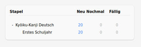
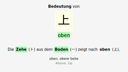
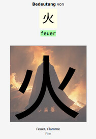
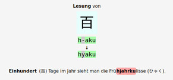

# Kanji Data

**This is a fork from https://github.com/davidluzgouveia/kanji-data**

I added to the `kanji-kyouiku.json` more information for German kanji learners.
The preprocessing code is written in Python. The following changes are made.

* Using https://www.kanji-trainer.org/Merksatz/index.html the German meanings are added. See `add_german` function.
* Using https://www.wanikani.com/radicals (downloaded to `wanikani_radicals.html`) we translate radical meaning to German. The translation was done manually with https://deepl.com. The translation can be investigated in `radical-translations.csv`. This is used to create `kanji-kyouiku-de-radicals.json`. There are also radical kanjis added. Since some radicals changed in WaniKani, unused ones are sorted out. See `radicals_check` function.
* Since the Silkworm has missing data, it is removed from the dataset.
* The dataset is a dict. To sort it, it is converted to an array of dicts, see `kanji-kyouiku-de-radicals-array.json`. It is ordered by grade and kanji unicode. See `dict_to_array` function.
* Mnemonic sentences are prepared and manually filled. The keys are `mnemonic_meaning_de` and `mnemonic_reading_de`. It is written to `kanji-kyouiku-de-radicals-array-mnemonics.json`. See `prepare_mnemonics` function.
* The `kanji-kyouiku-de-radicals-array-mnemonics-wip.json` is the Work-In-Progress (WIP) file that is filled manually. The `watch_copy_to_docs.sh` is used to copy it to `docs`.
* In `docs` folder is `kyouiku-de.html` which shows a table of the kanjis and mnemonics.
* In `img` folder are image (`*-img.jpg`) and kanji (`*-kanji.jpg`, transparent `*-kanji.png`) pairs to give a visual clue for those kanji which are radicals. Almost all images are generated (thanks to [pollinations](https://image.pollinations.ai/prompt/), [deepai](https://deepai.org/machine-learning-model/text2img) and [craiyon](https://www.craiyon.com/)), some are manually post-processed. There is now an option `"has_radical_img": true` to enable the visual clue in `kyouiku-de.html`. Using CSS, image and kanji are overlapped and blended in an animation.
* The order given by the table in [Kyōiku-Kanji](https://de.wikipedia.org/wiki/Ky%C5%8Diku-Kanji) is used to sort entries in `kanji-kyouiku-de-radicals-array-mnemonics-wip.json`. Every entry has an `order_wiki` key.
* Completed entries are provieded as Anki cards (see section below).
* **Milestone**: In `kanji-kyouiku-de-radicals-array-mnemonics-wip.json` for the first grade [Kyōiku-Kanji](https://de.wikipedia.org/wiki/Ky%C5%8Diku-Kanji#Erstes_Schuljahr_(80_Kanji)) all mnmemonics and in `img` all visual clues are completed.


### Lesung Merksatz Leitfaden

Um gute Merksätze für Lesungen zu schreiben, ist hier ein Leitfaden mit Empfehlungen zusammengefasst.

1. Die Lesung sollte ein Prefix eines deutschen Wortes sein. Beispiel: **Ka**mm (か).
2. Ist ein Perfix nicht möglich, präferiere ein Postfix. Beispiel: At**tacke** (たけ).
3. Wenn Prefix und Postfix nicht möglich sind, präferiere ein Infix. Beispiel: Me**dai**llons (だい).
4. Wenn Prefix, Postfix und Infix nicht möglich sind, erzeuge ein (erfundenes) Komposita. Beispiel: Emb**ryoku**gel (りょく), Wasser**hahnna**hrung (はな).
5. Wenn Prefix, Postfix, Infix und Komposita nicht möglich sind, erzeuge ein Satz mit mehreren Wörtern. Beispiel: **Hai ja schi**kaniert (はやし).
6. Gleiche Laute können bei der Verbindung von Wörtern genutzt werden. Beispiel: **ich Chips** (いち), **muss Schi**cksal (むし).
7. Das Merkwort sollte so kurz wie möglich sein. Beispiel: **San**d (さん).
8. Vermeide englische, japanische oder ungebräuchliche Wörter. Beispiel:  *engl.* **hatch** (はち), *jap.* **Shou**gun (しょう) oder **io**nisiert (よ) [Chemie Domäne].
9. Bei lang gezogenen Vokalen in der Lesung möglichst auch ein Wort, das auch ein lang gezogenen Vokal hat. Beispiel: **Kuh** (くう).
10. Bevorzuge Aussprache vor Aussehen. Beispiel: Fleiß**igju**gend (きゅう), anstatt Fleißi**kyuu**gend (きゅう).
11. Vermeide Wörter, die weiter gelesen eine andere Lesung ergeben könnten. Beispiel: Für も nimm nicht **Mo**kka, da es auch die Lesung もか sein könnte.
12. Vermeide Namen von Personen, Organisationen, Orten und anderen Entitäten. Beispiel: **Jo**hn (じょ).
13. Der Merksatz sollte so kurz wie möglich sein.
14. Die Merkwörter, die die Lesung enthalten, sollten am Satzende stehen.

### Anki

> [Anki](https://apps.ankiweb.net/) is a program which makes remembering things easy. Because it's a lot more efficient than traditional study methods, you can either greatly decrease your time spent studying, or greatly increase the amount you learn.

Using data from `kanji-kyouiku-de-radicals-array-mnemonics-wip.json` Anki decks are generated (see `make_anki` function). They are stored in the [anki](/anki) folder as `*.apkg` files.

Three card types are available:
* Bedeutung Merksatz Karte - learn the meaning of kanjis by mnemonic sentences.
* Bedeutung Merkbild Karte - learn the meaning of kanjis by visual clues.
* Lesung Merksatz Karte - learn the reading of kanjis by mnemonic sentences.

For reading input there are two versions: hiragana or romaji. The latter proves to be useful when the learners do not have a Japanese input method. For multiple reading possibilities, a separator is used (by default space `" "`).

#### Screenshots









### JSON Example

An entry in `kanji-kyouiku-de-radicals-array-mnemonics-wip.json` has the following structure:


```json
{
    "strokes": 3,
    "grade": 1,
    "freq": 97,
    "jlpt_old": 4,
    "jlpt_new": 5,
    "meanings": [
        "Below",
        "Down",
        "Descend",
        "Give",
        "Low",
        "Inferior"
    ],
    "readings_on": [
        "か",
        "げ"
    ],
    "readings_kun": [
        "した",
        "しも",
        "もと",
        "さ.げる",
        "さ.がる",
        "くだ.る",
        "くだ.り",
        "くだ.す",
        "-くだ.す",
        "くだ.さる",
        "お.ろす",
        "お.りる"
    ],
    "wk_level": 1,
    "wk_meanings": [
        "Below",
        "^Down",
        "^Under",
        "^Beneath"
    ],
    "wk_readings_on": [
        "か",
        "げ"
    ],
    "wk_readings_kun": [
        "!した",
        "!さ",
        "!くだ",
        "!お"
    ],
    "wk_radicals": [
        "Ground",
        "Toe"
    ],
    "meanings_de": [
        "unten",
        "abwärts",
        "hinabsteigen"
    ],
    "wk_radicals_new": [
        "Ground",
        "Toe"
    ],
    "wk_radicals_missing": [],
    "wk_radicals_de": [
        "Boden",
        "Zehe"
    ],
    "wk_radicals_kanji": [
        "一",
        "ト"
    ],
    "kanji": "下",
    "kanji_ord": 19979,
    "is_radical": false,
    "mnemonic_meaning_de": "Im <span class='radical' data-kanji='一'>Boden</span> <span class='radical_kanji'>(一)</span> steckt meine <span class='radical' data-kanji='ト'>Zehe</span> <span class='radical_kanji'>(ト)</span> und zeigt nach <span class='meaning' data-kanji='下'>unten</span> <span class='meaning_kanji_meaning'>(下)</span>.",
    "mnemonic_meaning_de_done": true,
    "mnemonic_reading_de": "Haare hängen nach <span class='meaning' data-kanji='下'>unten</span> <span class='meaning_kanji_reading'>(下)</span>, also mit <span class='reading onyomi' data-hiragana='か'>Ka</span>mm <span class='hiragana'>(か)</span> und <span class='reading onyomi' data-hiragana='げ'>Ge</span>l <span class='hiragana'>(げ)</span> stylen.",
    "mnemonic_reading_de_done": true,
    "order_wiki": 14
}
```

**Radical -> Meaning Mnmemonic**

A German sentence that combines the radicals to form the meaning.

> Im <span class='radical' data-kanji='一'>**Boden**</span> <span class='radical_kanji'>(一)</span> steckt meine <span class='radical' data-kanji='ト'>**Zehe**</span> <span class='radical_kanji'>(ト)</span> und zeigt nach <span class='meaning' data-kanji='下'>**unten**</span> <span class='meaning_kanji_meaning'>(下)</span>.

**Meaning -> Reading Mnmemonic**

A German sentence that uses markup annotation to emphasize how to read the kanji.

> Haare hängen nach <span class='meaning' data-kanji='下'>**unten**</span> <span class='meaning_kanji_reading'>(下)</span>, also mit <span class='reading onyomi' data-hiragana='か'>**Ka**</span>mm <span class='hiragana'>(か)</span> und <span class='reading onyomi' data-hiragana='げ'>**Ge**</span>l <span class='hiragana'>(げ)</span> stylen.
