# Chinesische Zeichen & Lesungen

Nach den leicht zu erlernenden ひらがな und カタカナ Silbenschriften, kommt nun die größte Herausforderung für Japanisch Lernende: die chinesischen Zeichen und ihre Lesungen.
Die Menge, Komplexität und mangelnde Zusammenhänge lassen Anfänger schnell verzweifeln, doch mit den richtigen Gedächtnistricks lassen sich in kleinen Schritten Lernerfolge erzielen.

## Herkunft

<a href="https://en.wikipedia.org/wiki/File:Shang_dynasty_inscribed_scapula.jpg" target="_blank">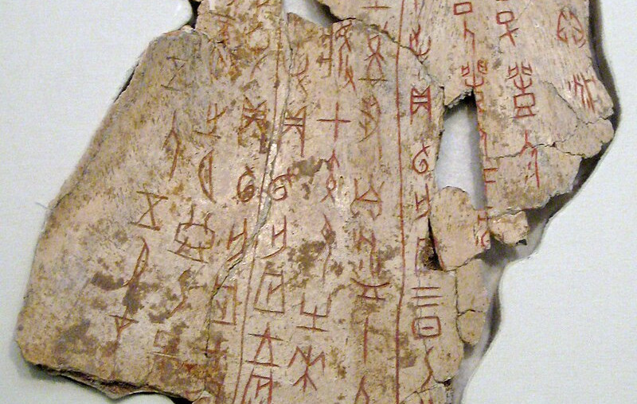</a>

Schon 1600 - 1000 v. Chr. haben Chinesen Piktogramme in [Orakelknochen](https://de.wikipedia.org/wiki/Orakelknochen) eingeritzt, woraus die Orakelknocheninschrift entstanden ist (vielleicht vergleichbar mit Höhlenmalerei).
Über die Zeit wurde Schrift immer wieder verfremdet, standardisiert, geändert, angepasst, vereinfacht, erneuert, uvm.
Wie sich die Zeichen über die Jahrhunderte verändert haben, kann man durch ein Nebeneinanderlegen nachvollziehen[^gemalte_wörter].
Im Folgenden präsentiert eine Tabelle absichtlich einfache Zeichen, um zu zeigen, wie Schriftzeichen sich bis in die Gegenwart gewandelt haben.

| Bedeutung |  Veränderung  |  Zeichen   |
| --- | --- | --- |
| <i class="fa fa-dog"></i> - Hund | 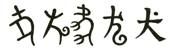  | [犬](https://en.wiktionary.org/wiki/%E7%8A%AC#Glyph_origin) |
| <i class="fa fa-child"></i> - Kind (Sohn) | 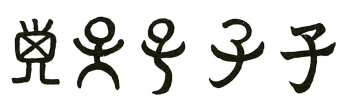  | [子](https://en.wiktionary.org/wiki/%E5%AD%90#Glyph_origin) |
| <i class="fa fa-mountain"></i> - Berg | 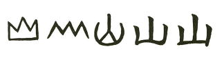  | [山](https://en.wiktionary.org/wiki/%E5%B1%B1#Glyph_origin) |

Bei ein paar grundlegende Zeichen funktioniert es noch, das ursprüngliche Piktogramm zu erahnen, jedoch bei den aller meisten nicht.
Sobald diese Zeichen komplexer werden, entstanden im Laufe der Jahre Verfremdungen, Verfälschlichungen oder Auslassen von Komponenten.
Deshalb ist es oft nicht mehr nachvollziehbar, warum ein Zeichen ein bestimmtes Konzept repräsentiert.

 
Wieviel dieser Zeichen in die japanische Schrift gelangt ist und wie sie in echten Texten verteilt sind, wird im folgenden Abschnitt erörtert.

## Menge und Verteilung

Für jede Sache und jedes Konzept gibt es mit Sicherheit ein chinesisches Zeichen oder ein zusammengesetztes Wort (Kompositum).
Aus diesem Grund sind über die Zeit wirklich sehr, sehr viele chinesische Zeichen entstanden (über 100.000).
Moderne chinesische Wörterbücher listen etwa 20.000 Zeichen auf, doch im tatsächlichen Gebrauch werden 10.000 geschätzt.
Gebildete Chinesen kennen ungefähr 6.000 Zeichen.
Mit 3.000 Zeichen hat man eine 99% Abdeckung in chinesischen Texten.

Eine Auswahl dieser Zeichen sind über die Zeit in mehreren Wellen aus verschiedenen Teilen Chinas nach Japan gelangt.
Heute werden sie in normalen japanischen Texten immer wieder verwendet.
Um zu regulieren, welche Zeichen das sind, hat man in Japan eine Liste von 2.136 Zeichen zusammen gestellt, die [Zeichen für den regulären Gebrauch](https://de.wikipedia.org/wiki/J%C5%8Dy%C5%8D-Kanji) enthalten.
Eine [Unterauswahl](https://de.wikipedia.org/wiki/Ky%C5%8Diku-Kanji) von 1.026 Zeichen machen schon ca. 95% aller in den japanischen Zeitungen verwendeten Schriftzeichen aus.
Diese Unterauswahl an sog. Unterrichtsschriftzeichen werden genutzt, um japanischen Kindern von der 1. bis zur 6. Schulklasse die Zeichen beizubringen.

Fazit: Von 100.000 möglichen, 20.000 in Wörterbüchern, 10.000 im chinesischen Gebrauch, 3.000 für 99% chinesische Textabdeckung, sind die Zeichen reduziert auf 2.136 in Japan verwendete und 1.026 für 95% japanische Textabdeckung.
Trotzdem sind ca. 1.000 bzw. 2.000 noch nie zuvor gesehene Zeichen für deutsche Muttersprachler ein hoher Lernaufwand.

Wie sich die Verteilung in echten japanischen Texten verhält, wird an zwei Beispielen veranschaulicht.
Betrachtet man einen zufällig ausgesuchten Paragraphen aus der [japanischen Wikipediaseite über Tokio](https://ja.wikipedia.org/wiki/%E6%9D%B1%E4%BA%AC), erhält man folgende Verteilung.

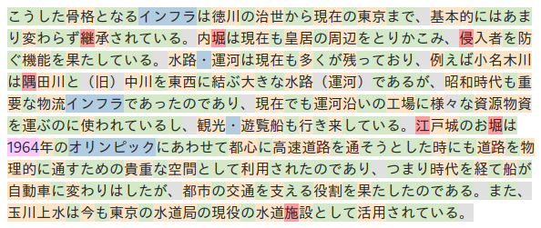

Bei den 357 Zeichen, findet man
* 172 ひらがな Silben (48%) grün hervorgehoben
* 16 カタカナ Silben (5%) - blau hervorgehoben
* 19 Satzzeichen (5%) - grau hervorgehoben
* 139 Unterrichtsschriftzeichen (39%) - aus der 1.026 Unterauswahl, gelb hervorgehoben
* 7 restliche Zeichen für den regulären Gebrauch (2%), rot hervorgehoben

Man erkennt, dass die Silbenschrift ca. 50% und die chinesischen Zeichen 40% ausmachen.
Der recht hohe Anteil an chinesischen Zeichen ist typisch für Fachartikel mit Fachwörtern.
Tatsächlich entsteht bei den Zeichen das oben erwähnte 95% Verhältnis bei den Unterrichtsschriftzeichen: `139 / (139 + 7) = 0.952`.
Hat man nur die Unterrichtsschriftzeichen gelernt, gibt es in diesem Paragraph 7 Wörter, die garnicht oder nur zum Teil verstanden werden können.

Als zweites Beispiel wird der [japanische Untertitel der ersten Folge](https://www.kitsunekko.net/dirlist.php?dir=subtitles%2Fjapanese%2FDragon_Ball%2F) der アニメ Serie [Dragon Ball](https://de.wikipedia.org/wiki/Dragon_Ball_(Anime)) auf gleiche Weise analysiert.

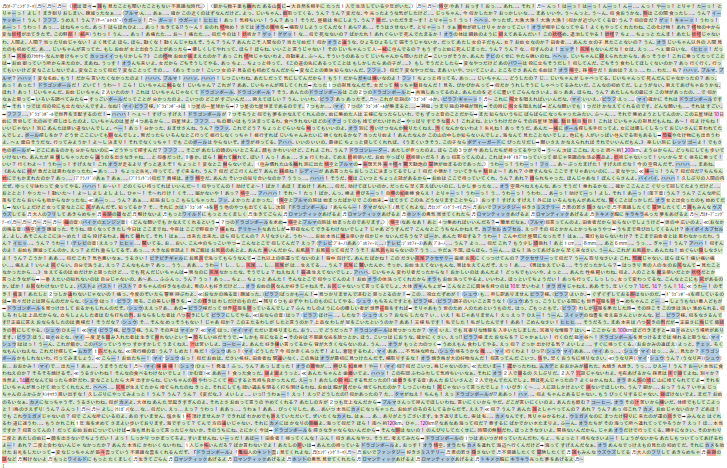

Bei den 11.377 Zeichen, findet man
* 5.803 ひらがな Silben (51%) grün hervorgehoben
* 860 カタカナ Silben (8%) - blau hervorgehoben
* 2.836 Satzzeichen (25%) - grau hervorgehoben
* 1.084 Unterrichtsschriftzeichen (10%) - aus der 1.026 Unterauswahl, gelb hervorgehoben
* 215 restliche Zeichen für den regulären Gebrauch (2%), rot hervorgehoben

Wegen Lautmalereien und Eigennamen ist der カタカナ Anteil diesmal höher.
Zudem machen die chinesischen Zeichen nur noch 12% des Textes aus, während ひらがな mit 51% überwiegt.
Der Grund ist wohl, dass sich die Serie an Kinder und Jugendliche ab 12 Jahre richtet und vom Inhalt kaum Fachwörter benötigt.
Mit nur 84% Textabdeckung der Unterrichtsschriftzeichen geht die 95%-Abschätzung für diesen Text diesmal nicht ganz auf.
Hat man nur die Unterrichtsschriftzeichen gelernt, sind 82 eindeutige Zeichen dem Leser unbekannt.

Fazit: Welche und wie viele chinesische Zeichen genutzt werden hängt stark vom Inhalt und der Zielgruppe des Textes ab.
Da die Zeichen essenziell für die japanische Sprache sind, werden sie in echten japanischen Texten immer wieder vorkommen.

 
Nachdem die Herkunft, die Menge und mögliche Verteilungen der Zeichnen beleuchtet wurde, wird nun der vielschichtige Aufbau der Zeichen erklärt.

## Komplexität

Im Gegensatz zu Silben und daren Aussprache sind chinesische Zeichen vielschichtiger und daher komplexer.
Um dies zu veranschaulichen, wird eine Dreiecksdarstellung verwendet (in Anlehnung an dem [semiotischen Dreieck](https://de.wikipedia.org/wiki/Semiotisches_Dreieck)):
in der Mitte befindet sich das chinesische Zeichen, während rundherum die drei Eigenschaften Bedeutung, Lesung und Zusammensetzung als Dreieck stehen.
Als Beispiel wird das Zeichen 親 gewählt, welches, wie viele andere Zeichen, in den drei Eigenschaften vielseitig ist.
Aufgrund Vielseitigkeit und Unschärfe sind die Eigenschaften Bedeutung, Lesung und Zusammensetzung als Wolken dargestellt.

<object data="kanji-dreieck.svg" style="width: 80%"></object>

**Bedeutung**: Mit dem 親 Zeichen kann mehr als eine Bedeutung assoziiert werden.
Das liegt daran, dass es in [Wörtern verwendung findet](https://jisho.org/search/%E8%A6%AA%20%23words%20%23common) mit diesen verschiedenen Bedeutungen.
Die meistverwendete Hauptbedeutung kann als *Eltern* angesehen werden, doch es gibt noch weitere, die damit verwandt oder assoziert werden können: *Intimität*, *Verwandtschaft*, *Vertrautheit*.
Tatsächlich findet das Zeichen auch Verwendung beim Spielen mit Karten oder Mahjong, sobald der Kartengeber (*Dealer*) gemeint ist.
 
Das Beispiel soll klar machen, dass oftmals eine unscharfe Bedeutungswolke aus mehreren Konzepten um ein Zeichen liegt.
Daher sollte man nicht eine klare Zeichen-Bedeutung-Zuordnung erwarten, sondern offen dafür sein, dass das Zeichen in verwandten und ähnlichen Zusammenhängen benutzt wird.
Trotzdem versucht man einem Zeichen eine Hauptbedeutung als Ankerpunkt zuzuordnen.
Im weiteren Text wird es in folgender Form bei den Zeichen geschrieben: <i>chinesisches Zeichen</i>|Hauptbedeutung, für das Zeichen oben also 親|Eltern.

**Lesung**: Auch bei der Lesung des Zeichens darf man keine klare Zeichen-Lesung-Zuordnung erwarten.
Wie eingangs erwähnt, sind aus historischen Gründen mehrere Lesung für ein Zeichen möglich:
Es kommt darauf an, in [welchem Wort](https://jisho.org/search/%E8%A6%AA%20%23words%20%23common) es steht.
Sammelt man alle Möglichkeiten ein, erhält man drei Lesungen: しん, おや und した.
Aus diesem Grund ist diese Eigenschaft ebenfalls als Wolke illustriert, da wie in einem Nebel unklar ist, wie des Zeichen nun wirklich zu lesen ist.
 
Mit dem Beispiel soll vermittelt werden, dass in den meisten Fällen mit mehreren Lesungen zu rechnen sind.

**Zusammensetzung**: Nüchtern betrachtet wirkt das Zeichen wie eine fast beliebige Anordnung von Strichen.
In Wahrheit setzt es sich aus drei Komponenten zusammen.
Diese Komponenten sind selbst wiederrum Zeichen mit den gleichen Eigenschaften (Bedeutung, Lesung, Zusammensetzung), weshalb sie als kleine Dreiecke dargestellt werden.
Durch diesen selbstbezogenen (rekursiven) Aufbau können komplexe Zeichen durch Zerlegung (Dekomposition) leichter erfasst und verstanden werden.
 
Das Beispiel soll zeigen, dass das Zeichen in seinem Aufbau ebenfalls komplex sein kann.
Da es aus vielen Komponenten bestehen kann, ist diese Eigenschaft auch als Wolke dargestellt.

Fazit: Im Beispiel von 親 bestehen alle drei Eigenschaften aus drei oder mehreren Elementen.
Egal welche Eigenschaft man betrachtet, man begegnet einer hohen Informationsmenge.
Daher weißt ein einzelnes Zeichen eine hohe Informationsdichte auf, was das Lernen der Zeichen so aufwendig macht.

 
Im Folgenden werden Lerntechniken behandelt, wie man Zusammensetzungen, Bedeutungen und Lesungen von chinesischen Zeichen erkennen und verinnerlichen kann.

### Zusammensetzungen Erkennen

<!--
* immer quadrat: vier gleich lange Seiten und vier rechte Winkel
* zeichen erzeugen zeichen
* Beispiel für was passiert: skalierung (quetschung), verschiebung, nicht rotation
-->

Ein chinesisches Zeichen passt immer in ein Quadrat, d.h. ein Viereck mit vier gleich langen Seiten und vier rechten Winkel.

親

Wenn ein Zeichen zusammengesetzt wird, muss es in das Quadrat passen und darf demnach nicht über den Rand gehen.
Aus diesem Grund müssen Zeichenkomponenten verformt und verschoben werden, um noch in den quadratischen Zeichenbereich Platz zu haben (auf Rotation wird verzichtet).
Um sich besser vorstellen zu können, auf welche Verformungen sich der Lernende verbereiten muss, werden hier ein paar Beispiele vorgestellt.
Der Teil der zu betrachtenden Verformung oder Positionierung ist blau hervorgehoben.

<table class="kanji_muster_table">
    <thead>
        <tr>
            <th>Komponenten</th>
            <th>Zusammensetzung</th>
            <th>Erklärung</th>
        </tr>
    </thead>
    <tbody>
        <tr>
            <td style="display: flex;">立 日</td>
            <td>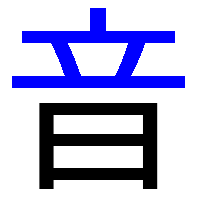</td>
            <td style="font-size: smaller;">Damit die Komponenten übereinander Platz haben, müssen sie gequetscht werden.</td>
        </tr>
        <tr>
            <td style="display: flex;">
                木
                寸
            </td>
            <td>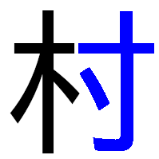</td>
            <td style="font-size: smaller;">
                Damit die Komponenten nebeneinander Platz haben, müssen sie ebenfalls gequetscht werden.
            </td>
        </tr>
        <tr>
            <td style="display: flex;">
                丿
                土
                儿
            </td>
            <td>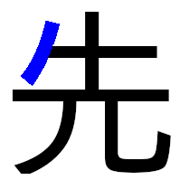</td>
            <td style="font-size: smaller;">
                Einfache Zeichen, die wie Striche aussehen, werden gerne an Seiten angehangen.
            </td>
        </tr>
        <tr>
            <td style="display: flex;">
                木
                日
            </td>
            <td>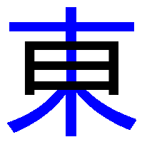</td>
            <td style="font-size: smaller;">
                Wenn Zeichen ineinander gezeichnet werden, kann es sein, dass das eine Zeichen lang gezogen wird.
            </td>
        </tr>
        <tr>
            <td style="display: flex;">
                竹
                合
            </td>
            <td>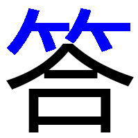</td>
            <td style="font-size: smaller;">
                Bei starker Quetschung verfremdet sich das Zeichen, da die Striche aus Platzgründen nur noch angedeutet werden können.
            </td>
        </tr>
    </tbody>
</table>

Manche Zeichen können in so kleinem Platz nicht vollständige gezeichnet werden, daher werden sie mit wenigen Strichen angedeutet.
Sie verfremden sich dadadurch sehr stark, weshalb man sie als eigene Komponenten auffassen kann.
<table class="kanji_muster_table">
    <thead>
        <tr>
            <th>Volles Zeichen</th>
            <th>Vereinfachte Komponente</th>
            <th>Beispielverwendung</th>
        </tr>
    </thead>
    <tbody>
        <tr>
            <td>手</td>
            <td>扌</td>
            <td>指</td>
        </tr>
        <tr>
            <td>水</td>
            <td>氵</td>
            <td>池</td>
        </tr>
        <tr>
            <td>人</td>
            <td>ｲ</td>
            <td>休</td>
        </tr>
    </tbody>
</table>

Fazit: Chinesische Zeichen sind nicht wahllos gezeichnete Striche, sondern setzen sich aus Komponenten zusammen.
Kennt man diese Komponenten und weiß, wie sie angeordnet und verformt werden dürfen, erkennt man sie leichter wieder.
<!--
 * Radikale sind es eigentlich nicht: https://www.hadamitzky.de/deutsch/sl_radikal.htm
 * https://japanleaks.de/japan/kultur/sprache/die-kanji-lernen-und-behalten-1-review/
-->

### Bild-basierte Bedeutung

Für bestimmte Zeichen ist eine weitere Zerlegung nicht mehr möglich oder es lohnt sich nicht, dies zu tun.
Es ist dann sinnvoll eine wiedererkennbare Einheit zu erlernen, die in anderen Zeichen so wiederverwendet wird.
In solchen Fällen kann man sich die visuelle Fähigkeiten des Gehirn mit Merkbildern zunutze machen.

<!-- TODO: hier könnte man auch erklären die glyph origin zu nehmen aber meist unpassend -->

Tatsächlich lassen sich die Komponenten von 親 nämlich 立, 木, und 見 nicht mehr sinnvoll zerlegen.
Um die Hauptbedeutung eines Zeichens klar zu machen, wird ein Bild verwendet, welches die Form und die Hauptbedeutung in einem Zug illustriert.
Durch das Überblenden zwischen Bild und Zeichen wird eine visuelle Assoziation geschaffen:
Sieht man das Zeichen später, erinnert man sich an das Bild und damit auch an die Hauptbedeutung zurück.

<table>
    <tr>
        <td>
            
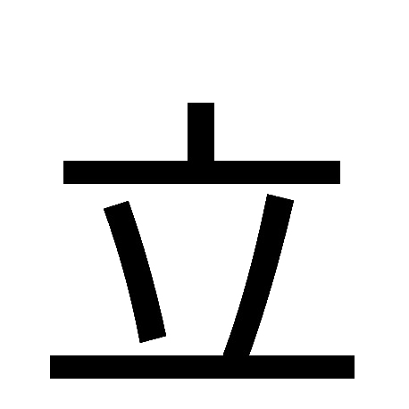

            

        </td>
        <td>
            
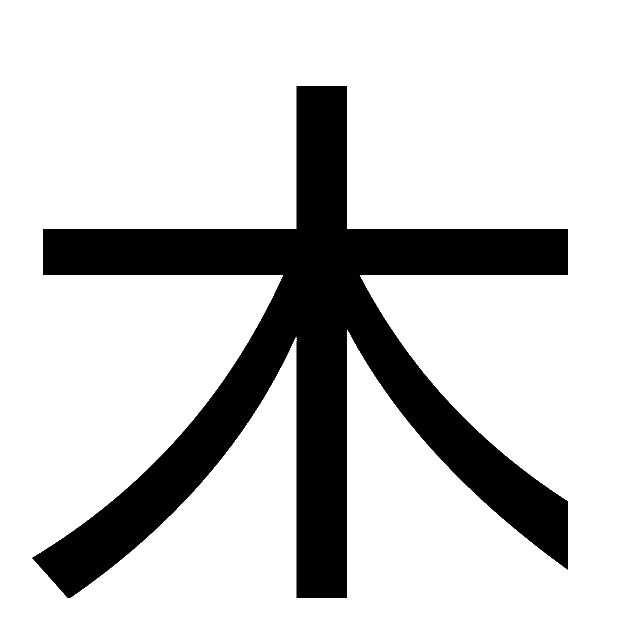

            

        </td>
        <td>
            
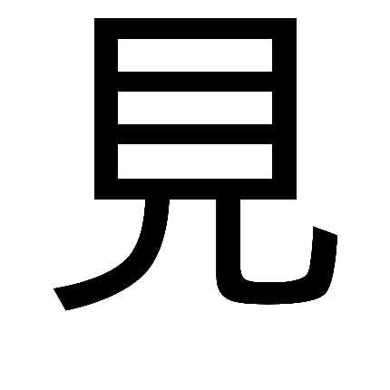

            

        </td>
    </tr>
    <tr>
        <td style="text-align: center;">Stehen</td>
        <td style="text-align: center;">Baum</td>
        <td style="text-align: center;">Sehen</td>
    </tr>
</table>

Normalerweise benötigt es nicht noch eine zusätzliche Erklärung, doch der Ratgeber möchte hier den Punkt der Merkbilder klar machen.
* Mit *Stehen* verbindet man emotional am stärksten das erste mal, wenn ein Kind stehen und laufen kann.
Die vertikalen Striche in 立 symbolisieren die Beine des Kindes, während die horizontalen Striche Boden und Arme illustrieren.
* Absichtlich ist bei dem Bild zur Bedeutung *Baum* eine Illustration gewählt, bei dem die Wurzeln so zulaufen, wie es die Form des Zeichens zeigt.
* Im Fall von *Sehen* kann man das Auge mit Iris und Pupille in der Form erahnen.
Die zwei geschwungenen Linien unten sollen Lichtstrahlen symbolisieren, die wir zum Sehen an das Auge aufnehmen.

Für einfache, Piktogramm-artige Zeichen mag diese Technik gut funktionieren.
Im Falle von komplexeren, zusammengesetzten Zeichen wird eine andere Merkhilfe ratsam.

### Komponenten-basierte Bedeutungen

Kann man von den Komponenten in einem chinesischen Zeichen auf seine Hauptbedeutung (und evtl. naheliegende Bedeutungen) schließen?

<!-- echte herkunft -->
Für komplexere chinesische Zeichen lässt sich, wie im Abschnitt [Herkunft](#herkunft) gezeigt, die Historie ermitteln.
[Im Fall von 親](https://en.wiktionary.org/wiki/%E8%A6%AA#Glyph_origin) ist es Folgende:
 
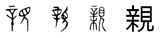
 
Tatsächlich soll die linke Seite ein Meißel mit einem Baum am unteren Ende darstellen als Hinweis auf einen Haselnusszweig, der als Peitsche verwendet wurde.
Der rechte Teil bleibt weiterhin 見|Sehen, wie oben gezeigt.
Wird damit also überliefert, dass Eltern unter Beobachtung mit Peitsche die Kinder erzogen haben?
Aus der Meißel-Haselnusszweig-Peitsche ist ganz klar erkennbar die Vereinfachung in ein 立 über einem 木 geworden.
Da diese beiden Komponenten schon eine Hauptbedeutung haben, ist es geschickt, sich diese für die Zusammensetzung zu merken, als ein neue Komponente erlernen zu müssen.
Die richtige Zerteilung erleichtert das Erkennen und unterstützt das aufeinander aufbauende Lernen von Zeichen genutzt als Komponenten.
Die echte Herkunft zu kennen ist zwar nett, kann aber das Lernen behindern, da Vereinfachungen, Veränderungen, Verformungen, veraltete Sichtweisen und eine andere Kultur die eigentliche Bedeutung schwer assoziierbar machen.

<!-- echte herkunft -->
Ein anderes Beispiel bildet [知](https://en.wiktionary.org/wiki/知#Glyph_origin) für die Hauptbedeutung 知|Wissen.
Tatsächlich zeigte das ursprüngliche Symbole im Orakelknochen eine Zusammensetzung aus 大|Erwachsener, 口|Mund und 子|Kind, als Erklärung, dass der Erwachsene sein Wissen an seine Kinder weitergibt.
Über die Zeit hat sich der 大|Erwachsene aber in 矢|Pfeil gewandelt und die 子|Kind Komponente wurde weggelassen.
Übrig bleibt 矢|Pfeil und 口|Mund, um 知|Wissen zu formen.
Wieder ist es schön, die echte Herkunft zu kennen, doch es hilft beim Lernen nicht, da man sich auf die heutige nun entstandene Form konzentieren muss.

<!-- andere interpretation -->
Natürlich kann es mehr als eine Zerlegungsmöglichkeit geben.
Zum Beispiel könnte man 親 auch in 辛|Pikant und gedachte ハ|Flossen sowie 見|Sehen zerteilen.
Die echte Zerlegung lässt sich manchmal von der Strichreihenfolge ableiten, doch in diesem Fall nicht, da [辛](https://jisho.org/search/%E8%BE%9B%20%23kanji) in [親](https://jisho.org/search/%E8%A6%AA%20%23kanji) enthalten ist.
Schlussendlich sollen die Zerlegungen als Merkhilfe dienen, bis sich das ganze Zeichen (親) als eine Bedeutungseinheit eingeprägt hat.
Daher könnten alternative Zerlegungen sinnvoll sein, wenn der Lernende sich die Zusammenstellung besser merken kann.

<!-- * Komponenten erhalten bedeutung, damit geschichten entstehen können -->
Jede Komponente sollte am besten ein Zeichen repräsentieren, dass man von seiner Hauptbedeutung gelernt hat und dann wiederverwenden kann.
Doch es gibt Komponenten, die selbst keine chinesischen Zeichen sind.
Hier empfiehlt es sich eine passende Bedeutung zu erfinden, um diesem Strichmuster eine virtuelle Bedeutung zu geben.
Erst dann kann der Lernende sich das Muster unter etwas merken und es auch benennen.
Das wurde z.B. eben getan, als *Flossen* (ハ) eingeführt wurde, weil diese zwei Striche an Fischflossen erinnern.
Wird aber in einem japanischen Wörterbuch nach diesem [Zeichen gesucht](https://jisho.org/search/%E3%83%8F%20%23kanji), findet man kein chinesisches Zeichen mit einer Bedeutung.

<!-- merksatz -->
Um auf die Frage am Anfang zurückzukommen:
Kann man von den Komponenten in einem chinesischen Zeichen auf seine Hauptbedeutung (und evtl. naheliegende Bedeutungen) schließen?
Ja, aber wählt man den echten historischen Weg, dann hat man mit Vereinfachungen, Veränderungen, Verformungen und Entfernung von Komponenten zu kämpfen.
Um sich einfach die Bedeutung eines Zeichens aus seinen Komponenten zu merken, reicht es schon allen Komponenten Bedeutungen zu geben und diese in Merksätze zusammenzuhängen (zu assozieren).
Aber wie passt dann 立|Stehen, 木|Baum und 見|Sehen zur Hauptbedeutung 親|Eltern?
Vielleicht mit folgendem Merksatz:

Im Stand (立) vom Baumhaus (木) sehen (見) meine Eltern (親) mir beim Spielen zu.

Die Komponenten werden zum besseren Erfassen grün und fett gedruckt hervorgehoben.
Der Merksatz ist so aufgebaut, dass die Komponenten in richtiger Reihenfolge von oben nach unten und links nach rechts genannt werden, wobei zum Schluss die zu merkende Hauptbedeutung kommt.
Man kann probieren noch weitere Bedeutungen wie *Intimität*, *Verwandtschaft* und *Vertrautheit* in den Merksatz mit aufzunehmen, muss aber aufpassen den Satz nicht zu überfrachten.
Bei diesem Merksatz macht man sich zunutze, dass 立 über 木 ein Baumhaus darstellen könnte.
Merksätze können die eigene Kultur besser aufgreifen:
Eine Szene in der Eltern ihren Kindern beim Spielen im Baumhaus zuschauen ist im Alltag in Deutschland denkbar.
Wenn der Lernende selbst in der Kindheit ein Baumhaus hatte, verknüpft sich diese emotionale Erinnerung durch den Merksatz noch stärker.
Auch wenn Merksätze vielleicht unwahr, obszön, frei erfunden oder angreifend sind, jedes Mittel ist recht eine emotionale Assoziation herzustellen, um schlussendlich einem komplexem chinesischem Zeichen eine Hauptbedeutung zuordnen zu können.

Tatsächlich lassen sich mit dieser Methode durch etwas Phantasie, der geschickten Zerteilung und der sinnvollen Komponenten-Bedeutung zuordnung Merksätze für alle 2.136 chinesische Zeichen erzeugen.
Da die Merksätze kleine Geschichten mit ausgewählten Konzepten erzählen, sind sie recht einfach zu erstellen und, dank der Art wie unser Gedächtnis funktioniert, einfach zu merken.

 
Mit dieser Technik kann man die Zusammensetzung- und Bedeutungseigenschaften der Zeichen assozieren.
Wie sich das auch auf die vielen verschiedenen Lesungen übertragen lässt, wird im nächsten Abschnitt behandelt.

### Lesungen

Wie bereits erwähnt, haben über Jahrhunderte japanische Schriftgelehrte chinesische Zeichen übernommen, sie mit der japanischen Aussprache von bekannten Konzepten in Verbindung gebracht und dabei auch die chinesische Aussprache, aber japanisch ausgesprochen, übernommen.
Aus diesem Grund [existieren nun Wörter](https://jisho.org/search/%E8%A6%AA%20%23words%20%23common) mit dem 親|Eltern Zeichen, bei dem es verschiedene Möglichkeiten gibt, es zu lesen, nämlich しん, おや und した.

Die verschiedenen Lesung für ein Symbol mag für deutsche Muttersprachler erstmal verwirrend sein.
Vielleicht ist es mit dem Beispiel zu erklären, dass wir die Buchstabenkombination "ei" üblicherweise als *ai* aussprechen.
Steht diese Buchstabenkombination aber in einem anderen Zusammenhang wie bei "Reis**ei**dee", sprechen wir es *e-i* aus.
Doch bei "Reis**ei**ntopf" ist es wieder *ai*.
Der Wort-Kontext, wie "ei" entstanden ist, d.h. was links und rechts von "ei" steht, entscheidet seine Aussprache.

Nicht alle Lesungen von chinesischen Zeichen tauchen gleich häufig auf.
Geht man alle gebräuchlichen Wörter (keine Fachwörter, spezielle Eigennamen, etc) mit dem 親|Eltern Zeichen durch, erhält man folgende Verteilung:
* しん in [14 Wörter](https://jisho.org/search/%E8%A6%AA%20%23words%20%23common%20%E3%81%97%E3%82%93) (52%)
* おや in [10 Wörtern](https://jisho.org/search/%E8%A6%AA%20%23words%20%23common%20%E3%81%8A%E3%82%84) (37%)
* した in [3 Wörtern](https://jisho.org/search/%E8%A6%AA%20%23words%20%23common%20%E3%81%97%E3%81%9F) (11%)

Lernt man also die Lesungen しん und おや hat man beim Lernen von Wörtern eine recht hohe Wahrscheinlichkeit, dass dort eine der beiden Lesung verwendet wird.

Damit ein Leser, der die Lesung von Zeichen nicht kennt, den Text trotzdem lesen kann, gibt es eine Lesehilfe.
Die Lesehilfe legt ひらがな oder カタカナ Silben über (oder neben) die chinesischen Zeichen, um ihre Aussprache zu vermitteln.
Diese spezielle Schrift (かな) wird ふりがな genannt.

> Merksatz: Wenn ich die chinesischen Zeichen nicht lesen kann, werde ich zur **Furi**e (ふり).

Wie ふりがな über den Zeichen geschrieben ist, wird anhand von verschiedenen Wörtern, in denen 親|Eltern vorkommt, gezeigt.
Dabei ist die Bedeutung (Übersetzung) der Wörter hier erstmal nebensächlich.

<ruby>親<rt>しん</rt>友<rt>ゆう</rt></ruby>、　<ruby>親<rt>おや</rt></ruby>、　<ruby>親<rt>おや</rt>指<rt>ゆび</rt></ruby>、　<ruby>親<rt>した</rt>しい</ruby>

Hier erkennt man gut, dass je nach dem welche Zeichen nach 親|Eltern geschrieben werden, sich das Wort und damit die Lesung ändern kann.

Die Lesungen lassen sich in zwei Kategorien einteilen:
die [Aussprache des Zeichens als japanischer Begriff](https://de.wikipedia.org/wiki/Kun-Lesung) und die [chinesische Aussprache](https://de.wikipedia.org/wiki/On-Lesung), aber japanisch ausgesprochen.
Man kann hier als Sprachwissenschaftler noch sehr ins Detail gehen.
Dieser Ratgeber empfiehlt die Lesungskategorie [kaum zu beachten](https://www.quora.com/Do-Japanese-people-know-which-pronunciations-of-kanji-are-kunyomi-and-which-are-onyomi-or-do-they-just-learn-them-without-regard-for-the-distinction), da die Lesung, wie oben gezeigt, stark vom Wort-Kontext abhängt.
Es gibt keine festen Regeln sondern nur ungefähre Daumenregeln, welche Lesungen verwendet werden.
Da sich Lesungen aus den beiden Kategorien auch mischen können, ist die Empfehlung die tatsächliche Lesung durch das gelernte Wort zu lernen (siehe Details im nächsten Kapitel über gebräuchliche Wörter).

Wie schnell sich Lesungen ändern können, wird an diesem Beispiel noch verdeutlicht:

<ruby>女<rt>おんな</rt>の<rt></rt>子<rt>こ</rt></ruby> und <ruby>女<rt>じょ</rt>子<rt>し</rt></ruby>

Aus diesem Grund sollte der Lernende immer auf der Hut sein, dass Lesungen in verschiedenen Wörtern auf manchmal unerklärliche Weise variieren.

<!-- schreiben können: beispiel mit google tastatur und screenshot -->
Durch das Wissen über die Lesung(en) von chinesischen Zeichen, ist man nun auch in der Lage, das Zeichen schreiben zu können.
Geht man wieder auf [Input Tools von Google](https://www.google.com/inputtools/try/) und stellt auf Japanisch, kann man es überprüfen.
Tippt man おや und nutzt die <kbd>Leertaste</kbd> bzw. <kbd><i class="fa fa-arrow-down"></i></kbd> Taste, sieht man verschiedene Möglichkeiten, was gemeint sein könnte.

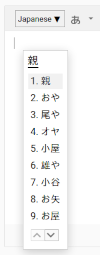

Da <ruby>親<rt>おや</rt></ruby> ein Wort ist, wird es direkt angezeigt.
Tippt man auf gleiche Weise nur しん ein, taucht 親 erst viel später in der Liste auf.
Da es erst mit しんゆう eindeutig ein Wort ergibt, sollten alle Silben eingegeben werden.

<!-- Wie "rett" ist nur der stamm meistens, grade bei einer silbe -->
Durch das Beispiel von しん erkennt man auch, dass Lesungen auch nur Wortstämme oder Wortteile sein können.
Gerade bei einer Silbe und wenn sie aus der chinesischen Aussprache kommt, kann es sehr gut sein, dass es ein Teil eines Wortes abbildet.
Zu Vergleichen ist das mit dem Beispielwort "Rettung":
Man lernt die Lesung "Rett", was selbst kein Wort darstellt, aber später das eigentliche Wort **Rett**ung, bei dem nur noch ein "ung" angehangen wird.

<!-- merksätze, regeln guter merksatz -->
Um Lesungen zu lernen, können ebenfalls Merksätze hilfreich sein.
Die Merksätze verbinden eine Hauptbedeutung mit den häufigsten Lesungen.
Ein Beispielmerksatz, wie man sich bei 親|Eltern die Lesungen おや und しん merken kann, könnte folgendermaßen aussehen:

Meine Eltern (親) sind ihrem Metzger loyal (おや), weil sie nur bei ihm die Schinkenwurst (しん) kaufen.

Der Satz macht sich zu nutze, dass bestimmte Laute beim Lesen eines deutschen Satzes möglichst nahe an der Aussprache der japanischen Silben liegen.
Für おや wird "loyal" verwendet, da es ein kurzes deutsches Wort ist, dass "oya" enthält und durch seine "l" Buchstaben nicht auf andere japanische Silben deuten lässt.
Es wird blau hervorgehoben, weil es eine japanische Aussprache ist (Merkhilfe: Japan ist von blauem Meer umgeben).
Für しん wurde "Schinkenwurst" gewählt, da der Anfang des Wortes wie しん ausgesprochen wird.
Es wird rot hervorgehoben, weil es eine chinesische Aussprache ist (Merkhilfe: Die chinesische Flagge ist hauptsächlich rot).
Diese Wörter dienen als Anker im Gedächtnis des Lernenden:
Anstatt zufällt gewählte Silbenzusammensätzungen (wie おや und しん) zu lernen, gibt man ihnen eine Bedeutung durch Nutzung von bereits bekannten deutschen Wörtern.

Hat man Hauptbedeutung "Eltern" sowie die Merkwörter "loyal" und "Schinkenwurst", lässt sich ein Satz erzeugen, der die Wörter in einem oder mehrere Sätze assoziiert (in der Vorstellung verknüpft).
In diesem Fall hat man sich dafür entschieden eine vielleicht recht typische deutsche Szene zu wählen, in dem die eigenen Eltern zum Metzger gehen und sich Wurst kaufen.

Um gute Merksätze für Lesungen zu schreiben, ist hier ein Leitfaden mit Empfehlungen zusammengefasst:
1. Die Lesung sollte ein Prefix eines deutschen Wortes sein. Beispiel: **Ka**mm (か).
2. Ist ein Prefix nicht möglich, präferiere ein Postfix. Beispiel: At**tacke** (たけ).
3. Wenn Prefix und Postfix nicht möglich sind, präferiere ein Infix. Beispiel: Me**dai**llons (だい).
4. Wenn Prefix, Postfix und Infix nicht möglich sind, erzeuge ein (erfundenes) Komposita. Beispiel: Emb**ryoku**gel (りょく), Wasser**hahnna**hrung (はな).
5. Wenn Prefix, Postfix, Infix und Komposita nicht möglich sind, erzeuge ein Satz mit mehreren Wörtern. Beispiel: **Hai ja schi**kaniert (はやし).
6. Gleiche Laute können bei der Verbindung von Wörtern genutzt werden. Beispiel: **ich Chips** (いち), **muss Schi**cksal (むし).
7. Das Merkwort sollte so kurz wie möglich sein. Beispiel: **San**d (さん).
8. Vermeide englische, japanische oder ungebräuchliche Wörter. Beispiel:  *engl.* **hatch** (はち), *jap.* **Shou**gun (しょう) oder **io**nisiert (よ) [Chemie Domäne].
9. Bei lang gezogenen Vokalen in der Lesung möglichst auch ein Wort, das auch ein lang gezogenen Vokal hat. Beispiel: **Kuh** (くう).
10. Bevorzuge Aussprache vor Aussehen. Beispiel: Fleiß**igju**gend (きゅう), anstatt Fleißi**kyuu**gend (きゅう).
11. Vermeide Wörter, die weiter gelesen eine andere Lesung ergeben könnten. Beispiel: Für も nimm nicht **Mo**kka, da es auch die Lesung もか sein könnte.
12. Vermeide Namen von Personen, Organisationen, Orten und anderen Entitäten. Beispiel: **Jo**hn (じょ).
13. Der Merksatz sollte so kurz wie möglich sein.
14. Die Merkwörter, die die Lesung enthalten, sollten am Satzende stehen.

Mit dieser Methode lassen sich ebenfalls Merksätze schreiben, um Hauptbedeutungen zu einer Auswahl an Lesungen zu assoziieren.
Da es Zeit benötigt, zur japanischen Silbenaussprache passende deutsche Wörter zu finden und sie in einen sinnvollen Satz zu vereinen, ist die Erzeugung dieser Merksätze aufwändiger.

 
Mit den beiden Merksatz-Arten lassen sich alle chinesischen Zeichen und ihre Lesungen erlernen.

## Lernen

Da es 2.136 Zeichen gibt mit der angesprochenen hochen Komplexität, will man für das Erlernen diese Komplexität absichtlich reduzieren, um sich für erste Lernerfolge erstmal auf das Wesentliche konzentrieren zu können.
Im Folgenden ist die Dreiecksdarstellung von oben abgebildet, aber diesmal mit Hinweisen zur Lernrichtung und -reduzierung.

<object data="kanji-dreieck-lernen.svg" style="width: 80%"></object>

Beim Lernen der chinesischen Zeichen werden folgende Assoziationen verinnerlicht:

**Zusammensetzung <i class="fa fa-long-arrow-alt-right"></i> Bedeutung**:
Um das Zeichen vollständig und unverwechselbar erfassen zu können, muss seine ganze Zusammensetzung gelernt werden.
Dadurch kann das Zeichen 親 in seine Komponenten 立, 木, und 見 zerlegt werden.
Dabei wird den Komponenten ihre Hauptbedeutungen zugeordnet, nämlich 立|Stehen, 木|Baum und 見|Sehen.
Mithilfe des gelernten Merksatzes "Im Stand (立) vom Baumhaus (木) sehen (見) meine Eltern (親) mir beim Spielen zu." gelangt man, angedeutet mit dem Pfeil, zur Hauptbedeutung 親|Eltern (bei Merkbildern durch die visuelle Erinnerung).
Sollte der Lernende das Zeichen schon soweit verinnerlicht haben, dass es als eine semantische Einheit angesehen wird, kann der Schritt übersprungen werden.
Man lässt hier absichtlich die anderen Bedeutungen außer Acht, damit man in der Lage ist, als Gedächtnisstütze jedem Zeichen mind. eine (manchmal auch mehr) Bedeutung zuschreiben zu können.
Die anderen Bedeutungen werden später durch das Lernen von Wörtern nach und nach mitgenommen.

**Bedeutung <i class="fa fa-long-arrow-alt-right"></i> Lesungen**:
Von der Bedeutung gelangt man über den folgenden Merksatz zu den Lesungen: "Meine Eltern (親) sind ihrem Metzger loyal (おや), weil sie nur bei ihm die Schinkenwurst (しん) kaufen".
Meist erinnert man sich an die Schlüsselwörter und kann dadurch recht genau おや und しん aus dem Gedächtnis rufen.
Gerade diese Verbindung muss intensiver gelernt werden, als die Vorherige.
Ein Grund dafür könnte sein, dass Merksätze mit Bedeutungen einen visuellen Anteil haben und daher greifbarer sind, während Merksätze für Lesungen eher auf Wort- bzw. Aussprachebene arbeiten können.
Später wird je nach Wort, in dem das Zeichen 親 vorkommt, die richtige Lesung und die eigentliche Bedeutung des Wortes erkannt.
Die übrigen Lesungen (wie した) werden durch das Lernen von Wörtern nach und nach mitgenommen.

**Zusammensetzung — Lesungen**: Diese graue dargestellte Verbindung ist nicht nützlich, da aus der Zusammensetzung in der Regel nicht auf die Lesung geschlossen werden kann.

<!-- Unterrichtsschriftzeichen -->
Es macht Sinn bei den 2.136 Zeichen sich zuerst auf die Unterauswahl der [Unterrichtsschriftzeichen](https://de.wikipedia.org/wiki/Ky%C5%8Diku-Kanji) zu konzentrieren, da diese am häufigsten auftreten und für die ca. 95% Textabdeckung sorgen.
Von der Reihenfolge dieser ca. 1.000 Zeichen kann man sich ebenfalls an die Vorgabe über die Schuljahre halten, weil komplexere Zeichen und abstraktere Bedeutungen eher im späteren Teil der Liste anfangen.
Jedoch müssen ab und zu Zeichen aus der Reihenfolge vorgezogen werden, damit sie gelernt werden, bevor sie als Komponenten in komplexeren Zeichen genutzt werden.

<!-- 100%, * level schreibweise einführen, vllt [100] -->
Bei der ersten Hürde von den ca. 1.000 Zeichen lässt sich der Lernfortschritt leicht ermitteln:
Jedes gelernte Zeichen macht 0,1% Fortschritt aus, d.h. bei z.B. 50 Zeichen ist man 5% voran gekommen.
Dadurch dass die Zeichen eine Reihenfolge haben, kann man ihnen ein Indexnummer geben, um zu signalisieren, wann das Zeichen bei dieser festen Lernreihenfolge kommen wird.
Die Indexnummer wird als Superscript angezeigt, z.B. folgendermaßen: 親[116]|Eltern.

Die chinesischen Zeichen müssen mit Hilfe der Merksätze durch verteilte Wiederholung im Gedächtnis verinnerlicht werden.

### Über Karteikarten lernen
<!-- anki, link, funktion -->

Mit digitalen Karteikarten und einer Lernkartei-Applikation lassen sich ideal Bedeutung und Lesungen der Zeichen erlernen.
Für [Anki](https://apps.ankiweb.net/) stellt dieser Ratgeber ein Karteistapel zur Verfügung, der für die Unterrichtsschriftzeichen Merkbilder und Merksätze zum Lernen bereitstellt.
Da die Abfrage der Lesungen über die Umschrift (Transkription) oder über ひらがな erfolgen kann, existieren zwei Versionen zum Download:
* [Unterrichtsschriftzeichen_Umschrift_Abfrage.apkg](anki/Unterrichtsschriftzeichen_Umschrift_Abfrage.apkg)
* [Unterrichtsschriftzeichen_Hiragana_Abfrage.apkg](anki/Unterrichtsschriftzeichen_Hiragana_Abfrage.apkg)

Wie der Lernende die Karteikarten nutzen kann, wird anhand von 親|Eltern in folgendem Anki-Screenshot gezeigt (Umschrift-Version).

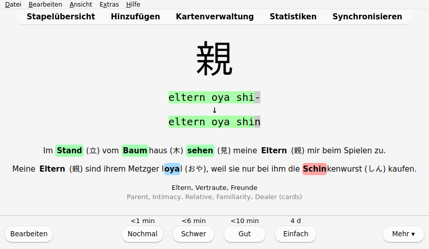

Für ein Zeichen wird der Benutzer aufgefordert, in einer Antwort die Hauptbedeutung und ausgewählte Lesungen einzutippen.
Danach sieht der Lernende, wie nah die Eingabe der erwarteten Antwort gekommen ist.
Zudem werden Merkbilder und/oder die Merksätze präsentiert, um die oben beschriebenen Assoziationen herzustellen.

In den Optionen kann der Lernende das Lerntempo selbst bestimmen, indem die Anzahl neuer Karten pro Tag gesetzt werden.
Ist dieser Wert zu hoch eingestellt, dann werden sich zwangsläufig viele Wiederholungen pro Tag ansammeln und den Lernaufwand erhöhen.
Der Lernende sollte das Lerntempo mit diesen Einstellungen an die eigene Beschäftigung im Alltag anpassen.

<!-- einstellung, menge, lerndauer -->
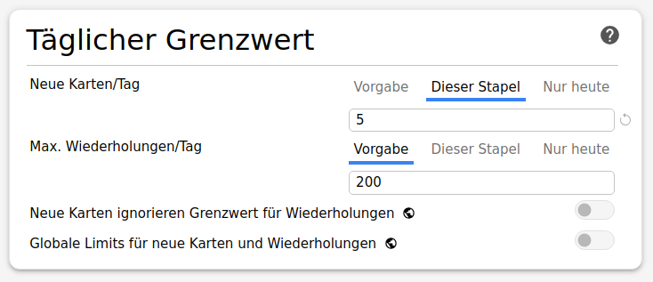

Bei konsequent fünf neuen Zeichen pro Tag, wird man in etwas mehr als einem halben Jahr alle Unterrichtsschriftzeichen gesehen haben: `1000 Zeichen / 5 Zeichen am Tage = 200 Tage = 6,6 Monate ≈ 1 Halbjahr`.

### Zeichen Formen Wörter

Das Lernen lohnt sich, denn schlussendlich geben chinesischen Zeichen Zugang zu echtem Vokabular.
Als Vorgriff auf das nächste Kapitel sind hier nochmal ein paar japanische Wörter aufgelistet, die auch in der deutschen Sprache verwendet werden (siehe [vorheriges Kapitel](silbenschrift.md#fazit)).
Tatsächlich wird man feststellen, dass viele japanische Wörter quasi gelesene chinesische Zeichen bzw. Komposita sind.
<table>
    <thead>
        <tr>
            <th>
                Wort
            </th>
            <th>
                Zeichen & Lesung
            </th>
            <th>
                Hauptbedeutung
            </th>
            <th>
                Indexnummer in
                Unterrichtsschriftzeichen
            </th>
        </tr>
    </thead>
    <tbody>
        <tr>
            <td>Bonsai</td>
            <td style="white-space: nowrap;"><ruby>盆<rt>ぼん</rt>栽<rt>さい</rt></ruby></td>
            <td style="white-space: nowrap;">
                盆|Schale
                栽|Bepflanzung
            </td>
            <td>
                盆[-], 栽[-]
            </td>
        </tr>
        <tr>
            <td>Emoji</td>
            <td style="white-space: nowrap;"><ruby>絵<rt>え</rt>文<rt>も</rt>字<rt>じ</rt></ruby></td>
            <td style="white-space: nowrap;">
                絵|Bild
                文|Text
                字|Buchstabe
            </td>
            <td style="white-space: nowrap;">
                絵[203], 文[62], 字[63]
            </td>
        </tr>
        <tr>
            <td>Judo</td>
            <td style="white-space: nowrap;"><ruby>柔<rt>じゅう</rt>道<rt>どう</rt></ruby></td>
            <td  style="white-space: nowrap;">
                柔|Zart/Sanft
                道|Landstraße/Weg
            </td>
            <td>
                柔[-], 道[185]
            </td>
        </tr>
        <tr>
            <td>Origami</td>
            <td style="white-space: nowrap;"><ruby>折<rt>お</rt>り<rt></rt>紙<rt>がみ</rt></ruby></td>
            <td  style="white-space: nowrap;">
                折|Falten
                紙|Papier
            </td>
            <td>
                折[534], 紙[200]
            </td>
        </tr>
        <tr>  
            <td>Tsunami</td>
            <td style="white-space: nowrap;"><ruby>津<rt>つ</rt>波<rt>なみ</rt></ruby></td>
            <td  style="white-space: nowrap;">
                津|Hafen
                波|Welle
            </td>
            <td>
                津[-], 波[364]
            </td>
        </tr>
    </tbody>
</table>

 

Nun können wir auch bereits eingeführtes Vokabular in richtiger Schreibweise ausdrücken.
<table>
    <thead>
        <tr>
            <th>
                Zeichen & Lesung
            </th>
            <th>
                Hauptbedeutung
            </th>
            <th>
                Indexnummer in
                Unterrichtsschriftzeichen
            </th>
        </tr>
    </thead>
    <tbody>
        <tr>
            <td style="white-space: nowrap;"><ruby>仮<rt>か</rt>名<rt>な</rt></ruby></td>
            <td style="white-space: nowrap;">
                仮|Schein
                名|Name
            </td>
            <td>
                仮[-], 名[43]
            </td>
        </tr>
        <tr>
            <td style="white-space: nowrap;"><ruby>平<rt>ひら</rt>仮<rt>が</rt>名<rt>な</rt></ruby></td>
            <td style="white-space: nowrap;">
                平|Flach
                仮|Schein
                名|Name
            </td>
            <td>
                平[315], 仮[-], 名[43]
            </td>
        </tr>
        <tr>
            <td style="white-space: nowrap;"><ruby>片<rt>かた</rt>仮<rt>か</rt>名<rt>な</rt></ruby></td>
            <td style="white-space: nowrap;">
                片|Einseitig
                仮|Schein
                名|Name
            </td>
            <td>
                片[911], 仮[-], 名[43]
            </td>
        </tr>
        <tr>
            <td style="white-space: nowrap;"><ruby>振<rt>ふ</rt>り<rt></rt>仮<rt>が</rt>名<rt>な</rt></ruby></td>
            <td style="white-space: nowrap;">
                振|Schütteln/Winken
                仮|Schein
                名|Name
            </td>
            <td>
                振[-], 仮[-], 名[43]
            </td>
        </tr>
        <tr>
            <td style="white-space: nowrap;"><ruby>漢<rt>かん</rt>字<rt>じ</rt></ruby></td>
            <td style="white-space: nowrap;">
                漢|Chinesisch
                字|Buchstabe
            </td>
            <td>
                漢[377], 字[63]
            </td>
        </tr>
    </tbody>
</table>

Die letzte Zeile der Tabelle enthüllt, um was es in diesem Kapitel ging, nämlich um die chinesischen Zeichen, die die Japaner <ruby>漢<rt>かん</rt>字<rt>じ</rt></ruby> nennen.

## Fazit

Aus eingeritzten Piktogrammen in Orakelknochen sind über die Jahrtausende die heutigen chinesische Zeichen entstanden, von denen 2.136 in Japan für den regulären Gebrauch standardisiert sind.
Die 1.026 Unterauswahl an Unterrichtsschriftzeichen machen schon ca. 95% aller in den japanischen Zeitungen verwendeten Schriftzeichen aus.
Da die Zeichen essenziell in der japanischen Sprache sind, müssen sie erlernt werden.
Doch die hohe Komplexität und hohe Informationsdichte erschwert das Lernen:
Ein Zeichen allein kann mehrere Bedeutungen repräsentieren, verschiedene Lesungen haben und eine komplexe Zusammensetzung aufweisen.
Mit Merkbildern lassen sich immerhin einfache, Piktogramm-artige Zeichen gut merken.
Bei komplexeren, komponenten-basierten Zusammensetungen helfen Merksätze.
Auf ähnliche Weise können auch Lesungen durch Merksätze eingeprägt werden.
Mit einem digitalen Karteikartenstapel und dem verteilten Lernen können Tag für Tag neue Zeichen verinnerlicht werden.

Die Zeichen geben einen wertvollen Zugriff auf echtes japanisches Vokabular, was im nächsten Kapitel über gebräuchliche Wörter erleutert wird.

 
 

---

[^gemalte_wörter]: Fazzioli, E. (2003). Gemalte Wörter. 214 chinesische Schriftzeichen
vom Bild zum Begriff, 5th edition. Fournierverlag.
