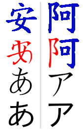
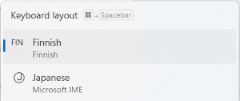
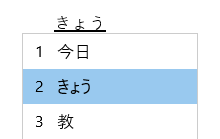

<audio id="audioPlayer"></audio>

# Japanische Silbenschrift & Aussprache

Wie Eingangs erwähnt gibt es zwei Silbenschriften, die durch ihren recht logischen Aufbau leicht zu lernen sind.
Doch es benötigt zuerst noch eine Umschrift.

## Transkription

Eine [Transkription](https://de.wikipedia.org/wiki/Transkription_(Schreibung)) ist eine Umschrift:
Es wird ein Schriftsystem (Skript) in ein anderes übertragen (*trans*feriert).
Diese neue Umschrift hilft dem Lernenden zu verstehen, wie die eigentliche Schrift ausgesprochen wird.
Dadurch soll es dem Nicht-Muttersprachler eine halbwegs richtige Aussprache von Wörtern ermöglichen.

Das Umschreiben wäre so, wie wenn man einen Japaner bittet, alle japanischen Silben vorzulesen.
Eine Deutscher soll das Gehörte in Kleinbuchstaben aufschreiben.
Wenn der Deutsche das Aufgeschriebene liest, klingt es sehr ähnlich zur Aussprache des Japaners.

Diesen Vorgang hat bestimmt [James Hepburn](https://de.wikipedia.org/wiki/James_Curtis_Hepburn) auch durchlaufen, um sein erstes Japanisch-Englisch Wörterbuch 1867 herausgeben zu können.
Er war aber Amerikaner, weshalb er möglicherweise die japanischen Laute anders wahrgenommen und umgeschrieben hat, als es ein Deutscher tun würde.
Neben seinem [Hepburn-Transkriptionsystem](https://de.wikipedia.org/wiki/Hepburn-System) gibt es noch [weitere](https://de.wikipedia.org/wiki/Japanische_Transkription): das Yale-System, das Kunrei-System und das Nippon-System.

Da das Hepburn-System am nächsten an der deutschen Aussprache liegt, sollte man mit diesem lernen.
Doch es gibt ein paar Besonderheiten, die zu beachten sind.

Die Umschrift ist als Hilfsmittel gedacht und sollte nicht als eigene Schrift gelernt und verwendet werden.
Sobald man durch diese Hilfsschrift die Laute der Silben erlernt hat, sollte man sich immer in den echten japanischen Schriften bewegen.
Aus diesem Grund wird Transkriptionstext in diesem Kapitel folgendermaßen dargestellt: *japanisch*|umschrift.
Der senkrechte Strich (|) soll als Trenner zwischen japanischer Schrift und Umschrift dienen.
Japanische Begriffe werden so per |umschrift geschrieben, wobei die linke Seite leer bleibt, sollten die japanischen Zeichen noch nicht eingeführt sein.

## Silbenschrift & Aussprache

<table style="border-width: 0px !important; width: 100%">
    <tr>
        <td style="width: 30%; vertical-align: top;">
             
            
        </td>
        <td style="vertical-align: top">

**Erste Spalte:**
Tatsächlich sind auch die Zeichen der ersten Silbenschriften Abwandlungen von chinesischen Zeichen (blau), die für die Aussprache genutzt werden.
Über die chinesische Grasschrift (rot) sind so Zeichen für die erste Silbenschrift entstanden (schwarz).

**Zweite Spalte:**
Auch die Zeichen der zweiten Silbenschriften sind aus chinesischen Zeichen (blau) durch Entnahme von Elementen (rot) und Vereinfachungen entstanden (schwarz).

Da die Zeichen eigentlich mit Pinsel gemalt werden, haben Linien variierende Anfänge, Breiten und Enden.
Die letzten Zeichen haben vereinfachte Formen, die man üblicherweise in der Computer-Schriftart findet: あ und ア.
        </td>
    </tr>
</table>

Die beiden Silbenschriften werden |kana genannt.

> Merksatz: Das Gesprochene wird in einer Schrift **kana**lisiert.

Die [erste Silbenschrift](https://de.wikipedia.org/wiki/Hiragana) ist |hiragana (linke Seite im Bild) und die [zweite Silbenschrift](https://de.wikipedia.org/wiki/Katakana) ist |katakana (rechte Seite im Bild).

> Merksatz: |hiragana wird **hier** in Japan geschrieben, mit |katakana werden Fremdworte **kata**logisiert.

Nicht wundern: |hira**ga**na meint |**ka**na, wird nur zwecks besseren Aussprechens von Japanern mit *g* statt *k* geschrieben und ausgesprochen.

Im Folgenden werden die beide Silbenschriften mit je 46 Grundsilben (Monographen) als Tabelle vorgestellt.
Darauf folgen noch Zusammensetzungen (Digraphen, je 21), zwei angebrachte kleine Zeichen, die die Aussprache verändern (Diakritika, je 25) sowie eine Kombination daraus (je 12).

### Grundsilben (Monographen)

<!--
immer aussprache mitnehmen
einfache aussprache mit farben: weiß, gelb (warn), rot (danger)
-->

Silben werden aus Konsonanten (im Zeilenkopf, links) und den bekannten Vokalen (im Spaltenkopf, oben) gebildet.
In den Zellen steht links das |hiragana Zeichen und rechts das |katakana Zeichen.
Bestimmte Kombinationen bei **y** und und **w** werden nicht mehr verwendet, daher sind sie ausgelassen.
Das **n** bildet eine eigene Silbe, was zuerst ungewohnt für deutsche Muttersprachler ist.

<table class="centered-table">
    <thead>
        <tr>
            <th></th>
            <th>a</th>
            <th>i</th>
            <th>u</th>
            <th>e</th>
            <th>o</th>
        </tr>
    </thead>
    <tbody>
        <tr>
            <th></th>
            <td>
                あ|a
                <button class="play-btn" onclick="loadAndPlay(this, 'hiragana_reading/a.wav')">
                    <i class="fas fa-play"></i>
                </button>
                ア|a
            </td>
            <td>
                い|i
                <button class="play-btn" onclick="loadAndPlay(this, 'hiragana_reading/i.wav')">
                    <i class="fas fa-play"></i>
                </button>
                イ|i
            </td>
            <td>
                う|u
                <button class="play-btn play-btn-warn" onclick="loadAndPlay(this, 'hiragana_reading/u.wav')">
                    <i class="fas fa-play"></i>
                </button>
                ウ|u
            </td>
            <td>
                え|e
                <button class="play-btn play-btn-warn" onclick="loadAndPlay(this, 'hiragana_reading/e.wav')">
                    <i class="fas fa-play"></i>
                </button>
                エ|e
            </td>
            <td>
                お|o
                <button class="play-btn" onclick="loadAndPlay(this, 'hiragana_reading/o.wav')">
                    <i class="fas fa-play"></i>
                </button>
                オ|o
            </td>
        </tr>
        <tr>
            <th>k</th>
            <td>
                か|ka
                <button class="play-btn" onclick="loadAndPlay(this, 'hiragana_reading/ka.wav')">
                    <i class="fas fa-play"></i>
                </button>
                カ|ka
            </td>
            <td>
                き|ki
                <button class="play-btn" onclick="loadAndPlay(this, 'hiragana_reading/ki.wav')">
                    <i class="fas fa-play"></i>
                </button>
                キ|ki
            </td>
            <td>
                く|ku
                <button class="play-btn" onclick="loadAndPlay(this, 'hiragana_reading/ku.wav')">
                    <i class="fas fa-play"></i>
                </button>
                ク|ku
            </td>
            <td>
                け|ke
                <button class="play-btn" onclick="loadAndPlay(this, 'hiragana_reading/ke.wav')">
                    <i class="fas fa-play"></i>
                </button>
                ケ|ke
            </td>
            <td>
                こ|ko
                <button class="play-btn" onclick="loadAndPlay(this, 'hiragana_reading/ko.wav')">
                    <i class="fas fa-play"></i>
                </button>
                コ|ko
            </td>
        </tr>
        <tr>
            <th>s</th>
            <td>
                さ|sa
                <button class="play-btn" onclick="loadAndPlay(this, 'hiragana_reading/sa.wav')">
                    <i class="fas fa-play"></i>
                </button>
                サ|sa
            </td>
            <td>
                し|shi
                <button class="play-btn play-btn-warn" onclick="loadAndPlay(this, 'hiragana_reading/shi.wav')">
                    <i class="fas fa-play"></i>
                </button>
                シ|shi
            </td>
            <td>
                す|su
                <button class="play-btn" onclick="loadAndPlay(this, 'hiragana_reading/su.wav')">
                    <i class="fas fa-play"></i>
                </button>
                ス|su
            </td>
            <td>
                せ|se
                <button class="play-btn" onclick="loadAndPlay(this, 'hiragana_reading/se.wav')">
                    <i class="fas fa-play"></i>
                </button>
                セ|se
            </td>
            <td>
                そ|so
                <button class="play-btn" onclick="loadAndPlay(this, 'hiragana_reading/so.wav')">
                    <i class="fas fa-play"></i>
                </button>
                ソ|so
            </td>
        </tr>
        <tr>
            <th>t</th>
            <td>
                た|ta
                <button class="play-btn" onclick="loadAndPlay(this, 'hiragana_reading/ta.wav')">
                    <i class="fas fa-play"></i>
                </button>
                タ|ta
            </td>
            <td>
                ち|chi
                <button class="play-btn play-btn-warn" onclick="loadAndPlay(this, 'hiragana_reading/chi.wav')">
                    <i class="fas fa-play"></i>
                </button>
                チ|chi
            </td>
            <td>
                つ|tsu
                <button class="play-btn" onclick="loadAndPlay(this, 'hiragana_reading/tsu.wav')">
                    <i class="fas fa-play"></i>
                </button>
                ツ|tsu
            </td>
            <td>
                て|te
                <button class="play-btn" onclick="loadAndPlay(this, 'hiragana_reading/te.wav')">
                    <i class="fas fa-play"></i>
                </button>
                テ|te
            </td>
            <td>
                と|to
                <button class="play-btn" onclick="loadAndPlay(this, 'hiragana_reading/to.wav')">
                    <i class="fas fa-play"></i>
                </button>
                ト|to
            </td>
        </tr>
        <tr>
            <th>n</th>
            <td>
                な|na
                <button class="play-btn" onclick="loadAndPlay(this, 'hiragana_reading/na.wav')">
                    <i class="fas fa-play"></i>
                </button>
                ナ|na
            </td>
            <td>
                に|ni
                <button class="play-btn" onclick="loadAndPlay(this, 'hiragana_reading/ni.wav')">
                    <i class="fas fa-play"></i>
                </button>
                ニ|ni
            </td>
            <td>
                ぬ|nu
                <button class="play-btn" onclick="loadAndPlay(this, 'hiragana_reading/nu.wav')">
                    <i class="fas fa-play"></i>
                </button>
                ヌ|nu
            </td>
            <td>
                ね|ne
                <button class="play-btn" onclick="loadAndPlay(this, 'hiragana_reading/ne.wav')">
                    <i class="fas fa-play"></i>
                </button>
                ネ|ne
            </td>
            <td>
                の|no
                <button class="play-btn" onclick="loadAndPlay(this, 'hiragana_reading/no.wav')">
                    <i class="fas fa-play"></i>
                </button>
                ノ|no
            </td>
        </tr>
        <tr>
            <th>h</th>
            <td>
                は|ha
                <button class="play-btn" onclick="loadAndPlay(this, 'hiragana_reading/ha.wav')">
                    <i class="fas fa-play"></i>
                </button>
                ハ|ha
            </td>
            <td>
                ひ|hi
                <button class="play-btn" onclick="loadAndPlay(this, 'hiragana_reading/hi.wav')">
                    <i class="fas fa-play"></i>
                </button>
                ヒ|hi
            </td>
            <td>
                ふ|fu
                <button class="play-btn play-btn-warn" onclick="loadAndPlay(this, 'hiragana_reading/hu.wav')">
                    <i class="fas fa-play"></i>
                </button>
                フ|fu
            </td>
            <td>
                へ|he
                <button class="play-btn" onclick="loadAndPlay(this, 'hiragana_reading/he.wav')">
                    <i class="fas fa-play"></i>
                </button>
                ヘ|he
            </td>
            <td>
                ほ|ho
                <button class="play-btn" onclick="loadAndPlay(this, 'hiragana_reading/ho.wav')">
                    <i class="fas fa-play"></i>
                </button>
                ホ|ho
            </td>
        </tr>
        <tr>
            <th>m</th>
            <td>
                ま|ma
                <button class="play-btn" onclick="loadAndPlay(this, 'hiragana_reading/ma.wav')">
                    <i class="fas fa-play"></i>
                </button>
                マ|ma
            </td>
            <td>
                み|mi
                <button class="play-btn" onclick="loadAndPlay(this, 'hiragana_reading/mi.wav')">
                    <i class="fas fa-play"></i>
                </button>
                ミ|mi
            </td>
            <td>
                む|mu
                <button class="play-btn" onclick="loadAndPlay(this, 'hiragana_reading/mu.wav')">
                    <i class="fas fa-play"></i>
                </button>
                ム|mu
            </td>
            <td>
                め|me
                <button class="play-btn" onclick="loadAndPlay(this, 'hiragana_reading/me.wav')">
                    <i class="fas fa-play"></i>
                </button>
                メ|me
            </td>
            <td>
                も|mo
                <button class="play-btn" onclick="loadAndPlay(this, 'hiragana_reading/mo.wav')">
                    <i class="fas fa-play"></i>
                </button>
                モ|mo
            </td>
        </tr>
        <tr>
            <th>y</th>
            <td>
                や|ya
                <button class="play-btn" onclick="loadAndPlay(this, 'hiragana_reading/ya.wav')">
                    <i class="fas fa-play"></i>
                </button>
                ヤ|ya
            </td>
            <td>
                </td>
            <td>
                ゆ|yu
                <button class="play-btn" onclick="loadAndPlay(this, 'hiragana_reading/yu.wav')">
                    <i class="fas fa-play"></i>
                </button>
                ユ|yu
            </td>
            <td>
                </td>
            <td>
                よ|yo
                <button class="play-btn" onclick="loadAndPlay(this, 'hiragana_reading/yo.wav')">
                    <i class="fas fa-play"></i>
                </button>
                ヨ|yo
            </td>
        </tr>
        <tr>
            <th>r</th>
            <td>
                ら|ra
                <button class="play-btn play-btn-warn" onclick="loadAndPlay(this, 'hiragana_reading/ra.wav')">
                    <i class="fas fa-play"></i>
                </button>
                ラ|ra
            </td>
            <td>
                り|ri
                <button class="play-btn play-btn-warn" onclick="loadAndPlay(this, 'hiragana_reading/ri.wav')">
                    <i class="fas fa-play"></i>
                </button>
                リ|ri
            </td>
            <td>
                る|ru
                <button class="play-btn play-btn-warn" onclick="loadAndPlay(this, 'hiragana_reading/ru.wav')">
                    <i class="fas fa-play"></i>
                </button>
                ル|ru
            </td>
            <td>
                れ|re
                <button class="play-btn play-btn-warn" onclick="loadAndPlay(this, 'hiragana_reading/re.wav')">
                    <i class="fas fa-play"></i>
                </button>
                レ|re
            </td>
            <td>
                ろ|ro
                <button class="play-btn play-btn-warn" onclick="loadAndPlay(this, 'hiragana_reading/ro.wav')">
                    <i class="fas fa-play"></i>
                </button>
                ロ|ro
            </td>
        </tr>
        <tr>
            <th>w</th>
            <td>
                わ|wa
                <button class="play-btn" onclick="loadAndPlay(this, 'hiragana_reading/wa.wav')">
                    <i class="fas fa-play"></i>
                </button>
                ワ|wa
            </td>
            <td>
            </td>
            <td>
            </td>
            <td>
            </td>
            <td>
                を|wo
                <button class="play-btn" onclick="loadAndPlay(this, 'hiragana_reading/o.wav')">
                    <i class="fas fa-play"></i>
                </button>
                ヲ|wo
            </td>
        </tr>
        <tr>
            <th>*</th>
            <td colspan="5">
                ん|n
                <button class="play-btn" onclick="loadAndPlay(this, 'hiragana_reading/n.wav')">
                    <i class="fas fa-play"></i>
                </button>
                ン|n
            </td>
        </tr>
    </tbody>
</table>

In der Mitte jeder Tabellenzelle befindet sich eine Schaltfläche, um die Aussprache abzuspielen.
Der Lernende sollte sich Zeit nehmen, die Laute mehrmals anzuhören.
Wer tiefer absteigen möchte, kann das [Internationalen Phonetischen Alphabet](https://de.wikipedia.org/wiki/Liste_der_IPA-Zeichen) konsultieren und über [Wiktionary](https://de.wiktionary.org/wiki/%E3%81%86) (z.B. von う|u) die Aussprache überprüfen.
Im Folgenden sind ein paar Besonderheiten herausgestellt (die Schaltflächen sind hervorgehoben).

* Das う|u ist ein ungerundetes Gegenstück zum deutschen *u*, was in Richtung *ü* geht.
* Das え|e klingt wie *ä*.
* Bei し|shi ist es nicht *sie* sondern *schi*.
* Bei ち|chi ist es nicht *tie* oder *chi* sondern *tschi*.
* Bei ふ|fu ist es zwischen [*hu* und *fu*](https://de.wikipedia.org/wiki/Stimmloser_bilabialer_Frikativ).
* Bei den **r** Lauten ist es ein Zungenschlag erzeugtes *r*, was sich wie ein *l* anhört, aber kein *l* ist.

<!-- TODO: ist wo nun o oder wo ausgesprochen? -->

#### Ähnlich aussehende |hiragana Zeichen

Hier ein paar Merksätze, um recht ähnlich aussehende Silben besser auseinander halten zu können.

> Der Unterschied zwischen め|me und ぬ|nu ist die geschwungene **Nu**del.

> Der Unterschied zwischen ろ|ro und る|ru ist wieder die **ru**nde Nudel.

> Der Unterschied zwischen ま|ma und ほ|ho ist der extra **ho**chkantstrich (|).

> Der Unterschied zwischen は|ha und ほ|ho ist der obere **ho**rizontalstrich (&ndash;).

> Der Unterschied zwischen わ|wa und ね|ne ist ei**ne** Schleife.

#### Ähnlich aussende |katakana Zeichen

Merksatz, um die ノ|no ähnlichen Silben nebeneinander zu sehen.
<table>
    <tr>
        <td>
            no,
        </td>
        <td>
            so
        </td>
        <td>
            'n
        </td>
        <td>
            shi
        </td>
        <td>
            tsu
        </td>
    </tr>
    <tr>
        <td>ノ</td>
        <td>ソ</td>
        <td>ン</td>
        <td>シ</td>
        <td>ツ</td>
    </tr>
</table>

Merksatz, um die フ|fu ähnlichen Silben nebeneinander zu sehen.
<table>
    <tr>
        <td>fu**,</td>
        <td>rate</td>
        <td>wo</td>
        <td>und</td>
        <td>wa-</td>
        <td>-rum</td>
    </tr>
    <tr>
        <td>フ</td>
        <td>ラ</td>
        <td>ヲ</td>
        <td></td>
        <td>ワ</td>
        <td>ウ</td>
    </tr>
</table>

> Der Unterschied zwischen ク|ku und ケ|ke ist der Ha**ke**n.

<!--
> Der Unterschied zwischen マ|ma ヌ|nu ist

> Der Unterschied zwischen ナ|na チ|chi ist
-->

### Zusammensetzungen (Digraphen)

<!-- Digraphen ya yu yo -->

Das や|ya, ゆ|yu und よ|yo kann kleingeschrieben werden: ゃ|ya, ゅ|yu und ょ|yo.
Zusammen mit den Konsonanten (außer **w**) entstehen neue Zusammensetzungen, die eigenständige Silben ergeben.

<table class="centered-table">
  <thead>
    <tr>
      <th>
      </th>
      <th>ya</th>
      <th>yu</th>
      <th>yo</th>
    </tr>
  </thead>
  <tbody>
    <tr>
      <th>k</th>
      <td> きゃ|kya
      <button class="play-btn" onclick="loadAndPlay(this, 'hiragana_reading/kya.wav')">
        <i class="fas fa-play">
        </i>
        </button> キャ|kya
      </td>
      <td> きゅ|kyu
      <button class="play-btn" onclick="loadAndPlay(this, 'hiragana_reading/kyu.wav')">
        <i class="fas fa-play">
        </i>
        </button> キュ|kyu
      </td>
      <td> きょ|kyo
      <button class="play-btn" onclick="loadAndPlay(this, 'hiragana_reading/kyo.wav')">
        <i class="fas fa-play">
        </i>
        </button> キョ|kyo
      </td>
    </tr>
    <tr>
      <th>s</th>
      <td> しゃ|sha
      <button class="play-btn" onclick="loadAndPlay(this, 'hiragana_reading/sha.wav')">
        <i class="fas fa-play">
        </i>
        </button> シャ|sha
      </td>
      <td> しゅ|shu
      <button class="play-btn" onclick="loadAndPlay(this, 'hiragana_reading/shu.wav')">
        <i class="fas fa-play">
        </i>
        </button> シュ|shu
      </td>
      <td> しょ|sho
      <button class="play-btn" onclick="loadAndPlay(this, 'hiragana_reading/sho.wav')">
        <i class="fas fa-play">
        </i>
        </button> ショ|sho
      </td>
    </tr>
    <tr>
      <th>t</th>
      <td> ちゃ|cha
      <button class="play-btn play-btn-warn" onclick="loadAndPlay(this, 'hiragana_reading/cha.wav')">
        <i class="fas fa-play">
        </i>
        </button> チャ|cha
      </td>
      <td> ちゅ|chu
      <button class="play-btn play-btn-warn" onclick="loadAndPlay(this, 'hiragana_reading/chu.wav')">
        <i class="fas fa-play">
        </i>
        </button> チュ|chu
      </td>
      <td> ちょ|cho
      <button class="play-btn play-btn-warn" onclick="loadAndPlay(this, 'hiragana_reading/cho.wav')">
        <i class="fas fa-play">
        </i>
        </button> チョ|cho
      </td>
    </tr>
    <tr>
      <th>n</th>
      <td> にゃ|nya
      <button class="play-btn" onclick="loadAndPlay(this, 'hiragana_reading/nya.wav')">
        <i class="fas fa-play">
        </i>
        </button> ニャ|nya
      </td>
      <td> にゅ|nyu
      <button class="play-btn" onclick="loadAndPlay(this, 'hiragana_reading/nyu.wav')">
        <i class="fas fa-play">
        </i>
        </button> ニュ|nyu
      </td>
      <td> にょ|nyo
      <button class="play-btn" onclick="loadAndPlay(this, 'hiragana_reading/nyo.wav')">
        <i class="fas fa-play">
        </i>
        </button> ニョ|nyo
      </td>
    </tr>
    <tr>
      <th>h</th>
      <td> ひゃ|hya
      <button class="play-btn" onclick="loadAndPlay(this, 'hiragana_reading/hya.wav')">
        <i class="fas fa-play">
        </i>
        </button> ヒャ|hya
      </td>
      <td> ひゅ|hyu
      <button class="play-btn" onclick="loadAndPlay(this, 'hiragana_reading/hyu.wav')">
        <i class="fas fa-play">
        </i>
        </button> ヒュ|hyu
      </td>
      <td> ひょ|hyo
      <button class="play-btn" onclick="loadAndPlay(this, 'hiragana_reading/hyo.wav')">
        <i class="fas fa-play">
        </i>
        </button> ヒョ|hyo
      </td>
    </tr>
    <tr>
      <th>m</th>
      <td> みゃ|mya
      <button class="play-btn" onclick="loadAndPlay(this, 'hiragana_reading/mya.wav')">
        <i class="fas fa-play">
        </i>
        </button> ミャ|mya
      </td>
      <td> みゅ|myu
      <button class="play-btn" onclick="loadAndPlay(this, 'hiragana_reading/myu.wav')">
        <i class="fas fa-play">
        </i>
        </button> ミュ|myu
      </td>
      <td> みょ|myo
      <button class="play-btn" onclick="loadAndPlay(this, 'hiragana_reading/myo.wav')">
        <i class="fas fa-play">
        </i>
        </button> ミョ|myo
      </td>
    </tr>
    <tr>
      <th>r</th>
      <td> りゃ|rya
      <button class="play-btn" onclick="loadAndPlay(this, 'hiragana_reading/rya.wav')">
        <i class="fas fa-play">
        </i>
        </button> リャ|rya
      </td>
      <td> りゅ|ryu
      <button class="play-btn" onclick="loadAndPlay(this, 'hiragana_reading/ryu.wav')">
        <i class="fas fa-play">
        </i>
        </button> リュ|ryu
      </td>
      <td> りょ|ryo
      <button class="play-btn" onclick="loadAndPlay(this, 'hiragana_reading/ryo.wav')">
        <i class="fas fa-play">
        </i>
        </button> リョ|ryo
      </td>
    </tr>
  </tbody>
</table>

Bei der Aussprache ist zu beachten:
* Bei der **t** Reihe z.B. ちゃ|cha wie ein *tscha* aussprechen, nicht wie *Charme* und nicht wie *Charisma*.

### Angebrachte kleine Zeichen (Diakritika)

Ein [diakritisches Zeichen](https://de.wikipedia.org/wiki/Diakritisches_Zeichen) sind angebrachte kleinen Zeichen, die eine abweichende Aussprache anzeigen.
Im deutschen Alphabet kennen wir die Umlaut-Punkte:
Damit wird z.B. der *A* Buchstabe wiederverwendet und ein neuer Laut durch hinzugefügte Zeichen erzeugt: *Ä*.

In der japanischen Schrift gibt es ein kleines angebrachtes Zeichen, dass wie Anführungszeichen (Gänsefüßchen) Oben aussieht:
&#x3099;.
Es wandelt stimmlose Konsonanten (nur Luftstrom) in stimmhafte Konsonanten (Ton mit Stimmlippen) um.

Für **h** gibt es zwei Varianten, da man mit den Lippen **b** aber auch **p** formen kann. Für **p** Laute wird ein Kreis verwendet: &#x309A;.

> Merksatz: Wird der Buchstabe **h** unten mit extra Strichen (&#x3099;) geschlossen, entsteht der Buchstabe **b**. Die horizontale Spiegelung ist **p** und wird durch einen **P**unkt oben (&#x309A;) markiert.

<table class="centered-table">
    <thead>
        <tr>
            <th></th>
            <th>a</th>
            <th>i</th>
            <th>u</th>
            <th>e</th>
            <th>o</th>
        </tr>
    </thead>
    <tbody>
        <tr>
            <th>k <i class="fa fa-arrow-right"></i> g</th>
            <td>
                が|ga
                <button class="play-btn" onclick="loadAndPlay(this, 'hiragana_reading/ga.wav')">
                    <i class="fas fa-play"></i>
                </button>
                ガ|ga
            </td>
            <td>
                ぎ|gi
                <button class="play-btn" onclick="loadAndPlay(this, 'hiragana_reading/gi.wav')">
                    <i class="fas fa-play"></i>
                </button>
                ギ|gi
            </td>
            <td>
                ぐ|gu
                <button class="play-btn" onclick="loadAndPlay(this, 'hiragana_reading/gu.wav')">
                    <i class="fas fa-play"></i>
                </button>
                グ|gu
            </td>
            <td>
                げ|ge
                <button class="play-btn" onclick="loadAndPlay(this, 'hiragana_reading/ge.wav')">
                    <i class="fas fa-play"></i>
                </button>
                ゲ|ge
            </td>
            <td>
                ご|go
                <button class="play-btn" onclick="loadAndPlay(this, 'hiragana_reading/go.wav')">
                    <i class="fas fa-play"></i>
                </button>
                ゴ|go
            </td>
        </tr>
        <tr>
            <th>s <i class="fa fa-arrow-right"></i> z</th>
            <td>
                ざ|za
                <button class="play-btn" onclick="loadAndPlay(this, 'hiragana_reading/za.wav')">
                    <i class="fas fa-play"></i>
                </button>
                ザ|za
            </td>
            <td>
                じ|ji
                <button class="play-btn play-btn-warn" onclick="loadAndPlay(this, 'hiragana_reading/ji.wav')">
                    <i class="fas fa-play"></i>
                </button>
                ジ|ji
            </td>
            <td>
                ず|zu
                <button class="play-btn" onclick="loadAndPlay(this, 'hiragana_reading/zu.wav')">
                    <i class="fas fa-play"></i>
                </button>
                ズ|zu
            </td>
            <td>
                ぜ|ze
                <button class="play-btn" onclick="loadAndPlay(this, 'hiragana_reading/ze.wav')">
                    <i class="fas fa-play"></i>
                </button>
                ゼ|ze
            </td>
            <td>
                ぞ|zo
                <button class="play-btn" onclick="loadAndPlay(this, 'hiragana_reading/zo.wav')">
                    <i class="fas fa-play"></i>
                </button>
                ゾ|zo
            </td>
        </tr>
        <tr>
            <th>t <i class="fa fa-arrow-right"></i> d</th>
            <td>
                だ|da
                <button class="play-btn" onclick="loadAndPlay(this, 'hiragana_reading/da.wav')">
                    <i class="fas fa-play"></i>
                </button>
                ダ|da
            </td>
            <td>
                ぢ|ji
                <button class="play-btn  play-btn-warn" onclick="loadAndPlay(this, 'hiragana_reading/ji.wav')">
                    <i class="fas fa-play"></i>
                </button>
                ヂ|ji
            </td>
            <td>
                づ|zu
                <button class="play-btn" onclick="loadAndPlay(this, 'hiragana_reading/zu.wav')">
                    <i class="fas fa-play"></i>
                </button>
                ヅ|zu
            </td>
            <td>
                で|de
                <button class="play-btn" onclick="loadAndPlay(this, 'hiragana_reading/de.wav')">
                    <i class="fas fa-play"></i>
                </button>
                デ|de
            </td>
            <td>
                ど|do
                <button class="play-btn" onclick="loadAndPlay(this, 'hiragana_reading/do.wav')">
                    <i class="fas fa-play"></i>
                </button>
                ド|do
            </td>
        </tr>
        <tr>
            <th>h <i class="fa fa-arrow-right"></i> b</th>
            <td>
                ば|ba
                <button class="play-btn" onclick="loadAndPlay(this, 'hiragana_reading/ba.wav')">
                    <i class="fas fa-play"></i>
                </button>
                バ|ba
            </td>
            <td>
                び|bi
                <button class="play-btn" onclick="loadAndPlay(this, 'hiragana_reading/bi.wav')">
                    <i class="fas fa-play"></i>
                </button>
                ビ|bi
            </td>
            <td>
                ぶ|bu
                <button class="play-btn" onclick="loadAndPlay(this, 'hiragana_reading/bu.wav')">
                    <i class="fas fa-play"></i>
                </button>
                ブ|bu
            </td>
            <td>
                べ|be
                <button class="play-btn" onclick="loadAndPlay(this, 'hiragana_reading/be.wav')">
                    <i class="fas fa-play"></i>
                </button>
                ベ|be
            </td>
            <td>
                ぼ|bo
                <button class="play-btn" onclick="loadAndPlay(this, 'hiragana_reading/bo.wav')">
                    <i class="fas fa-play"></i>
                </button>
                ボ|bo
            </td>
        </tr>
        <tr>
            <th>h <i class="fa fa-arrow-right"></i> p</th>
            <td>
                ぱ|pa
                <button class="play-btn" onclick="loadAndPlay(this, 'hiragana_reading/pa.wav')">
                    <i class="fas fa-play"></i>
                </button>
                パ|pa
            </td>
            <td>
                ぴ|pi
                <button class="play-btn" onclick="loadAndPlay(this, 'hiragana_reading/pi.wav')">
                    <i class="fas fa-play"></i>
                </button>
                ピ|pi
            </td>
            <td>
                ぷ|pu
                <button class="play-btn" onclick="loadAndPlay(this, 'hiragana_reading/pu.wav')">
                    <i class="fas fa-play"></i>
                </button>
                プ|pu
            </td>
            <td>
                ぺ|pe
                <button class="play-btn" onclick="loadAndPlay(this, 'hiragana_reading/pe.wav')">
                    <i class="fas fa-play"></i>
                </button>
                ペ|pe
            </td>
            <td>
                ぽ|po
                <button class="play-btn" onclick="loadAndPlay(this, 'hiragana_reading/po.wav')">
                    <i class="fas fa-play"></i>
                </button>
                ポ|po
            </td>
        </tr>
    </tbody>
</table>

Folgendes ist zu beachten:
* Bei **s** <i class="fa fa-arrow-right"></i> **z** wird es nicht **zi** sondern **ji** mit der Aussprache wie *dji*.
* Bei **t** <i class="fa fa-arrow-right"></i> **d** wird es nicht **di** sondern **ji** mit der Aussprache wie *dji*.
* Nicht wundern: In modernem japanisch werden folgende Silbenpaare tatsächlich [gleich ausgesprochen](https://japanese.stackexchange.com/a/1255) :
  * じ|ji und ぢ|ji
  * ず|zu und づ|zu

 

Die kleinen angebrachten Zeichen können auch auf die Zusammensetzungen angewandt werden.

<table class="centered-table">
  <thead>
    <tr>
      <th>
      </th>
      <th>ya</th>
      <th>yu</th>
      <th>yo</th>
    </tr>
  </thead>
  <tbody>
    <tr>
      <th>k <i class="fa fa-arrow-right"></i> g</th>
      <td> ぎゃ|gya
      <button class="play-btn" onclick="loadAndPlay(this, 'hiragana_reading/gya.wav')">
        <i class="fas fa-play">
        </i>
        </button> ギャ|gya
      </td>
      <td> ぎゅ|gyu
      <button class="play-btn" onclick="loadAndPlay(this, 'hiragana_reading/gyu.wav')">
        <i class="fas fa-play">
        </i>
        </button> ギュ|gyu
      </td>
      <td> ぎょ|gyo
      <button class="play-btn" onclick="loadAndPlay(this, 'hiragana_reading/gyo.wav')">
        <i class="fas fa-play">
        </i>
        </button> ギョ|gyo
      </td>
    </tr>
    <tr>
      <th>s <i class="fa fa-arrow-right"></i> z</th>
      <td> じゃ|ja
      <button class="play-btn play-btn-warn" onclick="loadAndPlay(this, 'hiragana_reading/ja.wav')">
        <i class="fas fa-play">
        </i>
        </button> ジャ|ja
      </td>
      <td> じゅ|ju
      <button class="play-btn play-btn-warn" onclick="loadAndPlay(this, 'hiragana_reading/ju.wav')">
        <i class="fas fa-play">
        </i>
        </button> ジュ|ju
      </td>
      <td> じょ|jo
      <button class="play-btn play-btn-warn" onclick="loadAndPlay(this, 'hiragana_reading/jo.wav')">
        <i class="fas fa-play">
        </i>
        </button> ジョ|jo
      </td>
    </tr>
    <tr>
      <th>h <i class="fa fa-arrow-right"></i> b</th>
      <td> びゃ|bya
      <button class="play-btn" onclick="loadAndPlay(this, 'hiragana_reading/bya.wav')">
        <i class="fas fa-play">
        </i>
        </button> ビャ|bya
      </td>
      <td> びゅ|byu
      <button class="play-btn" onclick="loadAndPlay(this, 'hiragana_reading/byu.wav')">
        <i class="fas fa-play">
        </i>
        </button> ビュ|byu
      </td>
      <td> びょ|byo
      <button class="play-btn" onclick="loadAndPlay(this, 'hiragana_reading/byo.wav')">
        <i class="fas fa-play">
        </i>
        </button> ビョ|byo
      </td>
    </tr>
    <tr>
      <th>h <i class="fa fa-arrow-right"></i> p</th>
      <td> ぴゃ|pya
      <button class="play-btn" onclick="loadAndPlay(this, 'hiragana_reading/pya.wav')">
        <i class="fas fa-play">
        </i>
        </button> ピャ|pya
      </td>
      <td> ぴゅ|pyu
      <button class="play-btn" onclick="loadAndPlay(this, 'hiragana_reading/pyu.wav')">
        <i class="fas fa-play">
        </i>
        </button> ピュ|pyu
      </td>
      <td> ぴょ|pyo
      <button class="play-btn" onclick="loadAndPlay(this, 'hiragana_reading/pyo.wav')">
        <i class="fas fa-play">
        </i>
        </button> ピョ|pyo
      </td>
    </tr>
  </tbody>
</table>

Folgendes ist zu beachten:
* Als deutscher Muttersprachler ist man verleitet じゃ|ja wie *ja*gt, じゅ|ju wie *ju*ng und じょ|jo wie *jo*deln auszusprechen.
Es ist aber immer ein *d*/*t* am Anfang, also じゃ|ja eher wie *Ja*ckett, じゅ|ju eher wie *Ju*nkie und じょ|jo eher wie *Jo*b.

### Besonderheiten

Anhand des Wortes がっこう|gakkou <button class="play-btn" onclick="loadAndPlay(this, 'word_reading/gakkou.mp3')"><i class="fas fa-play"></i></button> (dt. Schule) können wir noch zwei Besonderheiten erklären.

1. Es gibt das kleine っ|tsu, welches einen doppelten Konsonanten und kleine Pause erzeugt.
Anstatt *gako* wird es *gak-ko*.
2. Ist ein う|u nach einem *o* Laut, wird das *o* verlängert, wie wenn wir *oh* sagen.
Daher ist in der Aufnahme kein *u* am Ende zu hören, sondern ein langes *oh*.

<!-- とう lang gezogen:  hinter einem o ein u zur Verlängerung verwendet -->
<!-- kleines tsu (zwei tt) っ doppelter Konsonant -->
<!-- kleines a,e,i,o,u   tippe l + a　-->
<!-- kata: ー　lang gezogen　-->

### Fazit

Mit den Silben aus den Tabellen lassen sich nahezu alle japanischen Wörter bilden.
Nun können wir auch ひらがな|hiragana in ひらがな|hiragana und カタカナ|katakana in カタカナ|katakana schreiben.

[Ein paar Wörter](https://de.wikipedia.org/wiki/Liste_deutscher_W%C3%B6rter_aus_dem_Japanischen) aus dem Japanischen werden auch in der deutschen Sprache verwendet.
Man kann sie nun in echter japanischer Schrift schreiben:
* ぼんさい|bonsai - wörtlich: Topfpflanzung
* えもじ|emoji - Piktogramm (in elektronischen Textnachrichten)
* じゅうどう|juudou - wörtlich: sanfter Weg
* カラオケ|karaoke - wörtlich: leeres Orchester
* おりがみ|origami - wörtlich: Papierfalten
* さむらい|samurai - wörtlich: Dienender
* たまごっち|tamagocchi - ein Elektronikspielzeug
* つなみ|tsunami - wörtlich: Hafenwelle
* やくざ|yakuza - japanische Mafia

Mithilfe der Tabellen kann mühselig die einzelnen Silben nachgeschlagen werden.
Doch nicht nur das Lesen und Umschreiben ist wichtig:
Der Lernende sollte so früh wie möglich in die Lage versetzt werden, selbst die Schrift schreiben zu können.

## Selbst Schreiben Können

<!-- beispiel machen: animiertes gif -->

Hat man die Umschrift gelernt, kann man mit einer normalen deutschen Tastatur und der richtigen Einstellung selbst ひらがな|hiragana und カタカナ|katakana tippen.

### Online

Die [Input Tools von Google](https://www.google.com/inputtools/try/) können online ausprobiert werden.
Stellt man die Sprache auf Japanisch, kann man das Verhalten der Tastatur testen.
Auch [Yavego](https://www.yavego.com/tastatur-japanisch/) bietet eine Japanische Tastatur online an.

Doch besser ist es für sein Betriebsystem die richtige Eingabemethode einzustellen.

### Windows

In Windows kann über [Microsoft IME](https://support.microsoft.com/de-de/windows/microsoft-ime-f%C3%BCr-japanisch-da40471d-6b91-4042-ae8b-713a96476916) (Input Method Editor) die Tastatur auf Japanische Eingabe gestellt werden.
Am besten man folgt einer [Einstellungsanleitung](https://learn.microsoft.com/de-de/globalization/input/japanese-ime).

Nachdem Japanisch eingestellt ist, kann man ひらがな|hiragana eintippen.

### Unix

In Unix Systemen gibt es die [Universal Input Method (UIM)](https://wiki.archlinux.org/title/Uim).
Dort kann mit [Anthy](https://en.wikipedia.org/wiki/Anthy) die Japanische Eingabe hinzugefügt werden.

[Mozc](https://wiki.archlinux.org/title/Mozc) ist von Google und für mehrere Betriebsysteme implementiert worden.
Auch [Ubuntu](https://help.ubuntu.com/community/JapaneseInput) untersützt Mozc in seiner Distribution.

<!--
### Android

Die Google-Tastatur [Gboard](https://play.google.com/store/apps/details?id=com.google.android.inputmethod.latin) unterstützt auch Japanisch.
-->

### Generelle Nutzungshinweise

Verschiedene Eingabemethoden verhalten sich möglicherweise unterschiedlich.
Im Folgenden eine kurze Erklärung der Nutzung, wie es in den meisten Tastaturen der Fall sein müsste.
* Schreibe die Umschrift, wie in den Tabellen oben gezeigt.
Es entstehen die Silben, sobald sie vollständig geschrieben werden.
Beispielsweise entsteht きゃ|kya, sobald der letzte Buchstabe <kbd>ky**a**</kbd> getippt ist.
* Erst durch Drücken der <kbd>Eingabetaste</kbd> wird das geschriebene Wort in den Text übernommen.
* Durch das Drücken von <kbd>Leerzeichen</kbd> oder <kbd><i class="fa fa-arrow-down"></i></kbd> kann man durch verschiedene Formen wechseln.
Näheres dazu im nächsten Kapitel.
* Manche Tastaturen erlauben durch Drücken von Funktionstasten das Wort in seiner Schrift zu ändern (am Beispiel がっこう|gakkou).
  * <kbd>F6</kbd> ひらがな|hiragana-Modus: がっこう|gakkou
  * <kbd>F7</kbd> カタカナ|katakana-Modus: ガッコウ|gakkou
  * <kbd>F8</kbd> カタカナ|katakana-Halbe-Weite-Modus: ｶﾞｯｺｳ|gakkou
* Da mit <kbd>n</kbd> entweder ein **n** Laut wie z.B. な|na gemeint sein könnte oder einfach ん|n, muss man bei ん|n <kbd>nn</kbd> tippen.
* Tippe zweimal den selben Konsonanten, um ein kleines っ|tsu zu erhalten.
Alternativ kann man <kbd>ltsu</kbd> schreiben.
Das <kbd>l</kbd> steht für das englische Wort *lower* (dt. kleiner).

 

Silben tippen zu können und die Tabellen gesehen und verstanden zu haben, ist ein erster wichtiger Schritt.
Doch das hilft einem Anfänger trotzdem nicht, nun die Silbenschriften einfach lesen zu können.
Es erfordert nun das Lernen von Silbe zu Aussprache bzw. Transkription.

## Lernen durch Wiederholung

Der Lernende sollte sich nun ständig fordern, alle Silben der beiden Schriften ひらがな|hiragana und カタカナ|katakana lesen und umschreiben zu müssen, damit sich die Aussprache und Transkription im Gedächtnis festigt.

Nutzt man die [Anki](https://apps.ankiweb.net/) Lernkartei-Applikation, gibt es bereits gut gemachte [Kartenstapel](https://ankiweb.net/shared/decks?search=kana) für die Schriften.
* [Japanische Silben: Kana (Hiragana und Katakana)](https://ankiweb.net/shared/info/978901593) - deutsch
* [Tofugu: Learn Hiragana Deck](https://ankiweb.net/shared/info/1081858108) & [Tofugu: Learn Katakana Deck](https://ankiweb.net/shared/info/1027153995) - englisch, aber mit Merksätzen, Merkbildern und Aussprache Aufnahmen.
Daher auch empfohlen.

Für Android-Handys gibt es auch einige Apps im [Google Playstore](https://play.google.com/store/search?q=kana).
Ob als [Abfragetests](https://apkpure.com/kana-town-learn-japanese-hir/fr.koridev.kanatown) oder [spielerisch](https://play.google.com/store/apps/details?id=com.kazzuyak.kanagame), wichtig ist, dass man ständig gefordert wird zu einer Silbe die Umschrift tippen zu müssen.
[Spiele für den PC](https://store.steampowered.com/search/?term=kana) gibt es natürlich auch.

Lernende tendieren wegen der starken Nutzung von ひらがな|hiragana das カタカナ|katakana eher zu vernachlässigen.
Ich empfehle beide Schriften als gleich wichtig anzusehen und im Lernaufwand genau 50% ひらがな|hiragana und 50% カタカナ|katakana einzusetzen.
Man wird sich sonst beim Lesen von echten japanischen Texten immer ärgern, noch fundamentale Wissenslücken zu haben.

Es sollten auch immer alle Silben gelernt werden.
Dadurch wird das Gehirn darauf trainiert z.B. Ausschau nach dem &#x3099; Zeichen zu halten.
Zudem gewöhnt man sich daran, die angehangenen ゃ|ya, ゅ|yu und ょ|yo als eine Silbeneinheit zu betrachten und auszusprechen.

Dieser Abschnitt im Kapitel ist kurz, da hier nun die Arbeit des Lernenden im Vordergrund steht.
Die Silben-Aussprache-Paare müssen verinnerlicht werden, da sie fundamental sind für den weiteren Lernweg.

## Fazit

Mithilfe der Umschrift (Transkription) ist es möglich die aus chinesischen Zeichen stammende japanische Silbenschriften ひらがな|hiragana und カタカナ|katakana sowie ihre ungefähre Aussprache zu vermitteln.
In Tabellen wurden die Grundsilben, die Zusammensetzungen und Silben mit angebrachten Zeichen zusammengefasst.
Durch Abspielschaltflächen konnte man die einzelnen Silben durch Hören nachvollziehen.
Der Lernende sollte zudem in der Lage sein, durch eine ausgewählte Eingabemethode die Silben selbst schreiben zu können.
Am längsten müsste Zeit in das Lernen durch ständige Wiederholung gegangen sein, welches den Lernenden nun ermöglichen sollte, in Silbenschrift geschriebene Wörter entziffern zu können.

### Kleiner Test

Der Lernende sollte erst zum nächsten Kapitel übergehen, wenn alle Silben gelesen werden können.
Im Folgenden ist ein kleiner Test, um das selbst überprüfen zu können.
Nach jedem neuen Laden der Seite (<kbd>F5</kbd>) mischt sich eine neue ひらがな (links) und カタカナ (rechts) Silbenliste.
Durch Darüberhalten mit der Maus wird die Transkription aufgedeckt.
Erst wenn der Lernende bei wirklich allen Silben richtig lag, sollte das nächste Kapitel besucht werden.
Wurde ein Fehler gemacht, ist es nicht schlimm weiterhin beim [Lernen durch Wiederholung](#lernen-durch-wiederholung) zu bleiben.

<table>
    <tr>
        <td><ul id="hiragana-list"></ul></td>
        <td><ul id="katakana-list"></ul></td>
    </tr>
</table>

