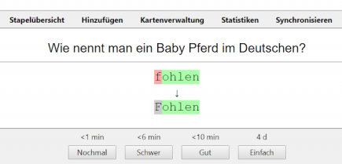

# Verteilte Wiederholungen

Würden wir uns Vokabeln, Merksätze oder Merkbilder nur einmal anschauen und danach nicht mehr beachten, wird unser Gehirn zwangsläufig diese scheinbar unnütze Information verblassen lassen.
Eine Sprache lernen ist nicht wie Fahradfahren lernen:
Durch ein paar Übungen am Fahrad werden motorische Bewegungsabläufe in einem bestimmten Gedächtnisteil gespeichert, weshalb fast keiner es jemals wieder verlernt.
Das Sprachenlernen funktioniert anders, weshalb eine ständige Wiederholung wichtig ist.

In der Schule ist man wahrscheinlich in Berührung gekommen mit Vokabelhefte.
Dort wurden die Vokabeln der Lektionen manuell festgehalten.
Sobald ein Vokabeltest anstand, wurden die Wortübersetzungen gelernt und im Test erinnert.
Die Wahrscheinlichkeit war groß, dass alte Vokabeln nicht erneut gelernt werden, weshalb sie schwerer im Gedächtnis bleiben.

Um dieses punktuelle Lernen zu vermeiden, sollte man Wiederholungen über die Zeit sinnvoll verteilen.
Dadurch wird man gezwungen, ab einer bestimmten Zeit sich wieder an alte Vokabeln erinnern zu müssen.
Man kann damit dem Vergessen durch Wiederholung entgegenwirken und behält Vokabeln länger.
Doch wann ist ein guter Zeitpunkt für eine Wiederholung?
Ein aus Papier bestehendes Vokabelheft kann dieses Management nur schwer leisten.

Karteikarten, die in einer Schachtel in verschiedene Stapel eingeteilt werden, bieten eine Verbesserung zum Vokabelheft.
Doch in unserem digitalen Zeitalter ist diese Herangehensweise ebenfalls veraltet.
Durch den Einsatz von Lernkartei-Software (an PC und/oder Smartphone) lässt sich ideal Lernrückmeldungen geben und daraus Wiederholungszeitpunkte intelligent errechnen.

<!-- anki -->
Eine sehr bekannte und offene Lernkartei-Applikation ist [Anki](https://apps.ankiweb.net/).
Es ist auf PC in allen Betriebsystemen sowie auf Smartphones verfügbar.
Im Grunde geht man mit Anki jeden Tag neue dazu kommende und sich wiederholende Karteikarten durch.
Ein beispielhaftes Bildschirmfoto ist im Folgenden abgebildet.

Eine Karteikarte stellt eine Aufgabe für den Lernenden, sich an etwas erinnern zu müssen.
Durch eintippen einer Antwort kann der Nutzer sich selbst testen, wie nah man der erwarteten Antwort gekommen ist.
Der Lernende gibt eine Selbstabschätzung ein, ob die gegebene Antwort schwer oder gut war.
Durch die Schwer-Option gibt man Anki Rückmeldung, dass die Karteikarte in Zukunft öfters kommen soll, da das Erinnern des Inhalts schwer fällt.
Mit der Gut-Option gibt man ein positives Feedback, dass die Erinnerung geklappt hat.
Die Nochmal-Option setzt die Karteikarte auf Anfang zurück und sollte genutzt werden, wenn man merkt, dass die Karte wie neu gelernt werden sollte.
Die Einfach-Option kann genutzt werden, um eine Karte weiter in die Zukunft zu legen, damit sie nicht so häufig wieder gelernt wird.

Anki kann als täglicher, digitaler, intelligenter Vokabeltester genutzt werden, der dem Lernenden genau die Vokabeln zeigt, die sinnvoll sind, gelernt zu werden, da Berechnungen darauf hindeuten, dass sie im Gehirn am verblassen sind.
Durch die verteilte Wiederholungen bleiben Vokabeln langfristiger im Gedächtnis.

---

* <https://de.wikipedia.org/wiki/Spaced_repetition>
* <https://www.dasgehirn.info/aktuell/frage-an-das-gehirn/kann-man-fahrradfahren-verlernen>
* <https://apps.ankiweb.net/>
* <https://de.wikipedia.org/wiki/Anki>
* <https://www.pruefungstrainer-psychotherapie.de/anki/Anki-Manual_Damien-Helmes.pdf>
